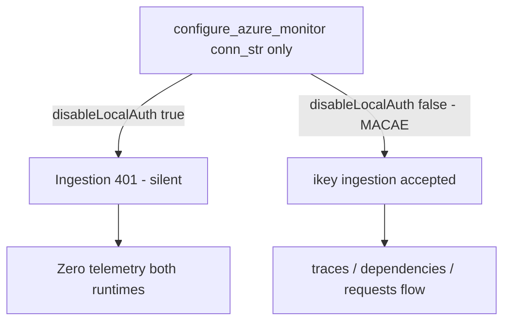

<!-- markdownlint-disable-file -->
# Task Research: BUG-0055 — Application Insights receives zero telemetry

Investigate why `appi-<SUFFIX>` (Application Insights) has received **zero** telemetry
ever from both the backend Container App and the Functions Container App on the live
`cwyd-cdb-v2` deployment, and determine the smallest correct fix.

## Task Implementation Requests

* Root-cause why zero telemetry reaches App Insights from the backend runtime.
* Root-cause why zero telemetry reaches App Insights from the Functions runtime.
* Determine the correct fix (code, config, Bicep, or RBAC) and validation steps.

## Scope and Success Criteria

* Scope: v2 backend (`v2/src/backend/**`), v2 functions (`v2/src/functions/**`),
  OpenTelemetry / Azure Monitor wiring, settings, and Bicep infra that injects the
  App Insights connection string / grants ingestion RBAC. Exclude v1 (`code/`).
* Assumptions:
  * The deployment is single-tenant, managed-identity-first, no Key Vault for app secrets.
  * App Insights `appi-<SUFFIX>` exists and is provisioned (BUG-0055 says it exists but is empty).
* Success Criteria:
  * A single verified root cause (or ranked set) for the zero-telemetry symptom on each runtime.
  * One recommended fix with exact file references (paths + line numbers) and rationale.
  * A concrete live-validation recipe (what to run, what KQL to query, expected signal).

## Outline

* Confirmed root cause (both runtimes): `disableLocalAuth: true` on App Insights + `configure_azure_monitor(connection_string=...)` with **no `credential=`** → silent 401 → zero telemetry.
* Secondary (backend deploy-state): the `AZURE_APP_INSIGHTS_CONNECTION_STRING` rename needs `azd provision`, not just `azd deploy`.
* Tertiary (functions host `requests`): needs `APPLICATIONINSIGHTS_AUTHENTICATION_STRING` and/or `host.json` `telemetryMode` — a documented follow-up, not required to close BUG-0055.
* Selected fix (user decision 2026-07-02 — **match MACAE**): set App Insights `disableLocalAuth: false` (enable local/ikey auth, matching MACAE's `avm/res/insights/component` which omits the flag). The existing connection-string-only `configure_azure_monitor` calls then ingest with **no credential** — no application code change. Reverses ADR-0018's `disableLocalAuth: true` for App Insights (needs an ADR amendment). The credential approach is retained below as the rejected alternative.

## Root Cause (confirmed)

**Primary — affects BOTH runtimes.** The App Insights component `appi-<SUFFIX>` is provisioned with `disableLocalAuth: true` (v2/infra/main.bicep line 326), which makes the ingestion data plane **refuse instrumentation-key / connection-string-only auth and require a Microsoft Entra bearer token**. Both `configure_azure_monitor` call sites pass a connection string but **no `credential=`**, so the exporter never presents a token and every ingestion request silently returns 401:

* Backend: `configure_azure_monitor(connection_string=conn_str)` — v2/src/backend/app.py line 71.
* Functions worker: `configure_azure_monitor(connection_string=conn_str)` — v2/src/functions/core/telemetry.py line 44.

This is the single cause that explains *both* halves being empty simultaneously and that survives the two prior fixes (the 2026-06-23 backend env-var rename and the functions worker-OTel wiring). The `Monitoring Metrics Publisher` role is **already granted** to the workload UAMI (main.bicep lines 330-336), so the identity is ready — the app code simply never uses it for telemetry.

**Corroborating evidence that isolates the auth path (not a value/plumbing gap):**

* The functions `APPLICATIONINSIGHTS_CONNECTION_STRING` was verified to match `appi-<SUFFIX>`'s ingestion endpoint + ikey exactly (bugs.md) — not a connection-string mismatch.
* The App Insights → Log Analytics link is healthy: the host emits ~500 `Information` rows/24h to `log-<SUFFIX>` `FunctionAppLogs` via the `allLogs` **diagnostic setting** (a platform path that does NOT use the SDK/Entra ingestion). So the sink works; only the SDK ingestion path is dead.
* `AZURE_ENVIRONMENT=production` is correctly wired on both containers (main.bicep lines 1804, 2159) — BUG-0069's failure mode does not apply, and telemetry is not gated on `environment` anyway.
* Adaptive sampling (`host.json`) thins volume; it never yields absolute `[0, null, null]`, and it governs the host pipeline, not the worker's OTel exporter.
* `azure-monitor-opentelemetry` 1.8.7 (+ exporter 1.0.0b51) and `azure-identity>=1.25` are installed in both containers — no missing dependency.

**Secondary — backend deploy-state.** The backend reads `AZURE_APP_INSIGHTS_CONNECTION_STRING` (`ObservabilitySettings`, `env_prefix="AZURE_"`); the Bicep now emits that name (main.bicep line 1911), but a Container App env-var change only reaches the live revision via `azd provision`, not `azd deploy` (image push). If the env has not been provisioned since 2026-06-23, the backend's typed setting is still empty and `configure_azure_monitor` never even runs. The credential fix requires a redeploy anyway, so a full `azd provision` / `azd up` clears this at the same time.

**Tertiary — functions host `requests`.** Host-emitted invocation telemetry (`requests`) comes from the Functions host, not the Python worker. Under `disableLocalAuth: true` the host needs `APPLICATIONINSIGHTS_AUTHENTICATION_STRING = "Authorization=AAD;ClientId=<uami-clientId>"` (and/or `host.json` `telemetryMode: OpenTelemetry`). This is a documented follow-up; worker `traces`/`dependencies`/`logs` are sufficient to prove BUG-0055 is resolved.

## Potential Next Research

* Confirm the exact `credential=` parameter name on the pinned `configure_azure_monitor` 1.8.7 signature (external best-practices doc confirms it exists; a source-level check removes the last caveat).
  * Reasoning: the fix depends on the kwarg name being `credential`.
  * Reference: azure-monitor-opentelemetry PyPI 1.8.7 / exporter 1.0.0b51.
* Live confirm the 401 ingestion path (optional): `az monitor app-insights` ingestion diagnostics, or a scratch `disableLocalAuth: false` deploy — would empirically prove the auth hypothesis before the code fix.
  * Reasoning: strengthens confidence; the logical chain (`disableLocalAuth:true` + no `credential`) is already airtight.
  * Reference: bicep-infra subagent doc §g.
* Decide whether host-level `requests` telemetry is in-scope for BUG-0055 closure (drives whether the tertiary follow-up is done now or deferred).

## Research Executed

### File Analysis

* v2/src/backend/app.py
  * Lines 25, 67-77: `configure_azure_monitor(connection_string=conn_str)` inside `_lifespan`, gated only on non-empty conn string. **No `credential=`.**
* v2/src/backend/core/settings.py
  * Lines 281-287: `ObservabilitySettings` (`env_prefix="AZURE_"`, field `app_insights_connection_string`) → env var `AZURE_APP_INSIGHTS_CONNECTION_STRING`.
  * Lines 137-147, 545: `IdentitySettings` field `uami_client_id` → env var `AZURE_UAMI_CLIENT_ID`; composed at `AppSettings.identity`.
* v2/src/functions/core/telemetry.py
  * Lines 24, 27-45: reads `APPLICATIONINSIGHTS_CONNECTION_STRING` via `os.environ.get`; `configure_azure_monitor(connection_string=conn_str)` at line 44. **No `credential=`.** Runs at module-import time (called from function_app.py lines 24-26).
* v2/src/functions/host.json
  * Lines 1-21: adaptive sampling on with `excludedTypes: "Request"`; no `logLevel` override; **no `telemetryMode`** (host OTel off).
* v2/infra/main.bicep
  * Line 316-339: App Insights AVM module `avm/res/insights/component:0.6.0`, workspace-based, `applicationType: 'web'`, **`disableLocalAuth: true` (line 326)**, `Monitoring Metrics Publisher` → UAMI (lines 330-336).
  * Lines 1904-1918: backend env `AZURE_APP_INSIGHTS_CONNECTION_STRING` (correct per-runtime name).
  * Lines 2188-2196: functions env `APPLICATIONINSIGHTS_CONNECTION_STRING`. **No `APPLICATIONINSIGHTS_AUTHENTICATION_STRING` anywhere in the tree.**
  * Lines 1804, 2159: `AZURE_ENVIRONMENT=production` on both.
* v2/tests/backend/test_app_lifespan.py
  * `test_lifespan_configures_app_insights_from_typed_settings` (line 418), `test_lifespan_skips_app_insights_when_typed_setting_empty` (line 464). Patch target: `backend.app.configure_azure_monitor` (line 454). ⚠️ The line-454 stub `_fake_configure(*, connection_string: str)` is keyword-only — a `credential=` arg will raise `TypeError` until the stub is widened and `AZURE_UAMI_CLIENT_ID` is set in the test env.
* v2/tests/functions/core/test_telemetry.py
  * `test_configure_telemetry_noop_without_connection_string` (line 8), `test_configure_telemetry_configures_when_connection_string_set` (line 22). Patch target: `functions.core.telemetry.configure_azure_monitor` (lines 16, 34). Both stubs use `**kw`, so `credential=` flows automatically.

### Code Search Results

* `configure_azure_monitor` → 2 call sites (backend app.py:71, functions telemetry.py:44), both connection-string-only.
* `ManagedIdentityCredential` / `from azure.identity import` across v2/src/** → **zero** matches. No sync-credential precedent; every credentials provider under `v2/src/backend/core/providers/credentials/` returns an **async** `azure.identity.aio.*` credential (base.py:8 `AsyncTokenCredential`, cli.py:11, managed_identity.py:15). The fix must construct sync `azure.identity.ManagedIdentityCredential(client_id=...)` directly.
* `disableLocalAuth` → main.bicep:326 (true). `Monitoring Metrics Publisher` → main.bicep:330-336 (granted to UAMI).
* `APPLICATIONINSIGHTS_AUTHENTICATION_STRING` / `Authorization=AAD` → zero hits tree-wide.

### External Research

* Microsoft Learn — Azure Monitor OpenTelemetry (Python) + Entra auth
  * `configure_azure_monitor()` reads `APPLICATIONINSIGHTS_CONNECTION_STRING` by default; when unset it raises `ValueError("Connection string is not set.")` (does not silently no-op) — so a *silent* zero-telemetry app means the call is gated/try-excepted or ingestion is rejected.
  * Under `DisableLocalAuth=true`, the app MUST pass `credential=` to `configure_azure_monitor(connection_string=..., credential=ManagedIdentityCredential(client_id="<client_id>"))` and the identity needs the **`Monitoring Metrics Publisher`** role (publishes ALL telemetry, not just metrics). Token audience (public cloud) = `https://monitor.azure.com`.
  * Recommended pattern: configure whenever a connection string is present, not gate on `environment == "production"`.
    * Source: [opentelemetry-enable](https://learn.microsoft.com/en-us/azure/azure-monitor/app/opentelemetry-enable?tabs=python), [azure-ad-authentication](https://learn.microsoft.com/en-us/azure/azure-monitor/app/azure-ad-authentication)
* MACAE (Multi-Agent Custom Automation Engine Solution Accelerator) cross-check — read-only pattern source per copilot-instructions
  * MACAE calls `configure_azure_monitor(connection_string=config.APPLICATIONINSIGHTS_CONNECTION_STRING, enable_live_metrics=True)` in `src/backend/app.py` — **connection-string-only, NO `credential=`**.
  * **Why MACAE needs no credential:** its App Insights component (`avm/res/insights/component:0.7.1`) omits `disableLocalAuth` → AVM default `false` → **local auth stays ENABLED**, so the instrumentation key in the connection string is accepted as auth. MACAE grants no `Monitoring Metrics Publisher` role (repo-wide search empty); its only `disableLocalAuth: true` are on AI Services + AI Search, never App Insights.
  * **Therefore MACAE is NOT a valid precedent for CWYD.** CWYD sets `disableLocalAuth: true` on App Insights (main.bicep line 326), so connection-string-only ingestion is refused — CWYD must diverge from MACAE and present an Entra token.
  * **MACAE DOES validate the credential construction:** it ships a sync credential factory `get_azure_credential()` → `DefaultAzureCredential(exclude_environment_credential=True)` in dev, else `ManagedIdentityCredential(client_id=AZURE_CLIENT_ID)` — the exact sync managed-identity pattern the CWYD fix uses (MACAE just never hands it to Azure Monitor). Same pins: `azure-monitor-opentelemetry==1.8.7`, `azure-identity==1.25.3`.
  * Source: subagent doc `.copilot-tracking/research/subagents/2026-07-02/bug-0055-macae-credential-pattern-research.md`; repo <https://github.com/microsoft/Multi-Agent-Custom-Automation-Engine-Solution-Accelerator>

### Project Conventions

* Standards referenced: `.github/copilot-instructions.md` (Hard Rule #14 SDK resilience/observability, #18 no env IDs, #1 one-unit, #2 test-first, #3 Pillar/Phase header). `v2/docs/adr/0018-monitoring-default-on-and-appi-rbac.md` (default-on monitoring, UAMI RBAC, `disableLocalAuth: true` WAF posture + Amendment 1 per-workload env-var names). User memory `config-defaults-dev-first.md` (dev-first defaults; prod flipped by IaC env vars).
* Instructions followed: `v2-backend.instructions.md` (OpenTelemetry wiring), `v2-infra.instructions.md` (Bicep, RBAC).

## Key Discoveries

### Project Structure

* Two independent telemetry entry points, deliberately reading different env-var names: backend `AZURE_APP_INSIGHTS_CONNECTION_STRING` (typed `ObservabilitySettings`) vs functions `APPLICATIONINSIGHTS_CONNECTION_STRING` (raw `os.environ`). Both call the same `configure_azure_monitor` distro; neither passes a credential.
* The credentials provider domain is **async-only** — it cannot be reused for `configure_azure_monitor`, which requires a sync `TokenCredential`. A short-lived sync `ManagedIdentityCredential` is the correct tool at both sites.

### Implementation Patterns

* Both runtimes already receive `AZURE_UAMI_CLIENT_ID` (and `AZURE_CLIENT_ID`) in their container env — the UAMI client id is available with no new Bicep wiring.
* Backend has `settings.identity.uami_client_id`; the functions worker (no typed settings) reads env directly.

### Complete Examples

**Selected (match MACAE) — no application code change; single Bicep edit.** v2/src/backend/app.py and v2/src/functions/core/telemetry.py stay exactly as they are today (`configure_azure_monitor(connection_string=conn_str)`, connection-string only). The only change enables local auth on the component so ikey ingestion is accepted — identical to MACAE:

```bicep
// v2/infra/main.bicep — App Insights module (avm/res/insights/component), line ~326
// Match MACAE: enable local auth so connection-string / ikey ingestion is accepted.
disableLocalAuth: false   // was: true  (or omit the param entirely — AVM default is false, as MACAE does)
```

Optionally, to fully match MACAE, also remove the now-unused `Monitoring Metrics Publisher` role assignment (main.bicep lines ~330-336) — MACAE grants no such role. Harmless if kept.

---

The credential-based code below is the **rejected alternative** (kept for reference), for the stricter `disableLocalAuth: true` posture.

Backend — v2/src/backend/app.py `_lifespan` (add a sync MI credential; `credential=None` falls back to connection-string auth for local dev where the client id is empty):

```python
from azure.identity import ManagedIdentityCredential
from azure.monitor.opentelemetry import configure_azure_monitor

# ... inside _lifespan, replacing lines 70-77:
conn_str = settings.observability.app_insights_connection_string.strip()
if conn_str:
    client_id = settings.identity.uami_client_id.strip()
    credential = ManagedIdentityCredential(client_id=client_id) if client_id else None
    configure_azure_monitor(connection_string=conn_str, credential=credential)
    logger.info("Application Insights telemetry configured.")
else:
    logger.info("AZURE_APP_INSIGHTS_CONNECTION_STRING not set; telemetry disabled.")
```

Functions worker — v2/src/functions/core/telemetry.py `configure_telemetry()`:

```python
import os
from azure.identity import ManagedIdentityCredential
from azure.monitor.opentelemetry import configure_azure_monitor

_APPLICATIONINSIGHTS_CONNECTION_STRING = "APPLICATIONINSIGHTS_CONNECTION_STRING"
_AZURE_UAMI_CLIENT_ID = "AZURE_UAMI_CLIENT_ID"

def configure_telemetry() -> bool:
    conn_str = os.environ.get(_APPLICATIONINSIGHTS_CONNECTION_STRING, "").strip()
    if not conn_str:
        logger.info("APPLICATIONINSIGHTS_CONNECTION_STRING not set; function telemetry disabled.")
        return False
    client_id = os.environ.get(_AZURE_UAMI_CLIENT_ID, "").strip()
    credential = ManagedIdentityCredential(client_id=client_id) if client_id else None
    configure_azure_monitor(connection_string=conn_str, credential=credential)
    logger.info("Application Insights telemetry configured for functions.")
    return True
```

### API and Schema Documentation

* `configure_azure_monitor(connection_string: str, credential: TokenCredential | None = None, ...)` — passing `credential=None` is identical to omitting it (connection-string auth); passing a sync `ManagedIdentityCredential` switches to Entra-token ingestion. Requires `Monitoring Metrics Publisher` on the target component (already granted).

### Configuration Examples

**Selected (match MACAE):** with local auth enabled, the Functions host's native App Insights integration ingests host `requests` telemetry via the connection string alone — no `APPLICATIONINSIGHTS_AUTHENTICATION_STRING` is needed (that env var is only required under `disableLocalAuth: true`). This is another simplification MACAE gets for free.

For the **rejected** `disableLocalAuth: true` alternative, host `requests` would instead need — v2/infra/main.bicep functions env block, alongside `APPLICATIONINSIGHTS_CONNECTION_STRING`:

```bicep
{
  name: 'APPLICATIONINSIGHTS_AUTHENTICATION_STRING'
  value: 'Authorization=AAD;ClientId=${userAssignedIdentity.outputs.clientId}'
}
```

## Technical Scenarios

### Scenario: match MACAE — enable App Insights local auth, connection-string ingestion, no credential

CWYD's App Insights sets `disableLocalAuth: true` (main.bicep line 326), which refuses ikey/connection-string ingestion and is the sole reason telemetry is empty (the existing code is already connection-string-only, exactly like MACAE). MACAE never sets `disableLocalAuth` on its App Insights component, so ikey ingestion works with no credential. Matching MACAE means enabling local auth on CWYD's component; the application code then needs **no change**.

**Requirements:**

* Set App Insights `disableLocalAuth: false` (or omit the param — AVM default is false, as MACAE does).
* Keep the application `configure_azure_monitor(connection_string=...)` calls unchanged (already MACAE-shaped).
* Reverse ADR-0018's `disableLocalAuth: true` decision for App Insights via an ADR amendment recording the MACAE-match rationale and the security tradeoff.
* Optionally remove the now-unused `Monitoring Metrics Publisher` UAMI role (MACAE has none) — harmless if kept.
* Still required (orthogonal to auth): the backend `AZURE_APP_INSIGHTS_CONNECTION_STRING` env-var rename must reach the live revision via `azd provision`.

**Preferred Approach — set App Insights `disableLocalAuth: false` (match MACAE); no application code change.**

Rationale (user decision 2026-07-02): matches the proven Microsoft reference-accelerator pattern (MACAE), is the smallest possible change (one Bicep line, zero app code), removes the credential/token machinery entirely, and eliminates the functions host-`requests` follow-up (the native host integration ingests via ikey once local auth is on). Tradeoff: it lowers the WAF posture — ikey-based ingestion is a weaker bar than Entra-token ingestion — which reverses ADR-0018 and must be captured in an ADR amendment. Since MACAE (a shipped Microsoft accelerator) uses exactly this posture, it is an accepted pattern.

```text
v2/infra/main.bicep                     (App Insights: disableLocalAuth true -> false; optionally remove Monitoring Metrics Publisher role assignment)
v2/docs/adr/0018-monitoring-default-on-and-appi-rbac.md   (amendment: reverse disableLocalAuth for App Insights to match MACAE)
v2/tests/... (infra guard, if desired)  (assert App Insights local auth enabled)
(no application code change — backend app.py + functions telemetry.py stay connection-string-only)
```



**Implementation Details:**

* Single Bicep unit (Hard Rule #1): flip `disableLocalAuth` on the App Insights module + the ADR-0018 amendment in the same change; an optional second unit removes the now-unused role assignment.
* No credential lifecycle, no sync/async concern, no changes to the telemetry call sites — the existing four telemetry tests already assert the connection-string-only behavior that stays.
* Optional MACAE parity (not required for the fix): add `enable_live_metrics=True` and `FastAPIInstrumentor.instrument_app(app, ...)` to the backend, as MACAE does — a separate enhancement, not part of the zero-telemetry fix.
* Rollout: `azd provision` / `azd up` applies the `disableLocalAuth` change AND the backend env-var rename together.
* Live validation KQL (ingestion delay ~1-3 min), classic AI Logs blade:

```kusto
union isfuzzy=true requests, traces, dependencies, exceptions, customMetrics
| where timestamp > ago(30m)
| summarize items = count(), LastSeen = max(timestamp) by itemType
| order by LastSeen desc
```

Workspace-based equivalent uses `AppTraces` / `AppDependencies` / `AppRequests` with `TimeGenerated` and `Type`.

#### Considered Alternatives

* **Credential-based ingestion — keep `disableLocalAuth: true`, pass a sync `ManagedIdentityCredential(client_id=...)` to `configure_azure_monitor` on both runtimes.** This was the prior recommendation and is the stricter, more secure posture (Entra-token ingestion; RBAC already granted; connection string passed only as the endpoint). Rejected per the user's decision to match MACAE, because it is net-new relative to MACAE, adds credential code to both runtimes plus a functions host-auth-string follow-up, introduces sync-credential construction the codebase does not otherwise use, and requires widening the keyword-only backend test stub. Retained here as the correct fix **if** the WAF posture must be preserved — revisit if a security review rejects re-enabling local auth. (Code refs for the alternative: backend app.py line 71, functions telemetry.py line 44, tests `test_app_lifespan.py` L418/L464 and `test_telemetry.py` L8/L22.)
* **Reuse the existing async credential provider** (only relevant to the credential alternative) — not usable: `configure_azure_monitor` requires a **sync** `TokenCredential`; the provider domain is async-only (`azure.identity.aio.*`).
* **Add `PYTHON_APPLICATIONINSIGHTS_ENABLE_TELEMETRY=true`** — irrelevant to the selected approach; with local auth enabled the existing explicit `configure_azure_monitor` call already ingests. Under the credential alternative it would still 401 without a credential.
