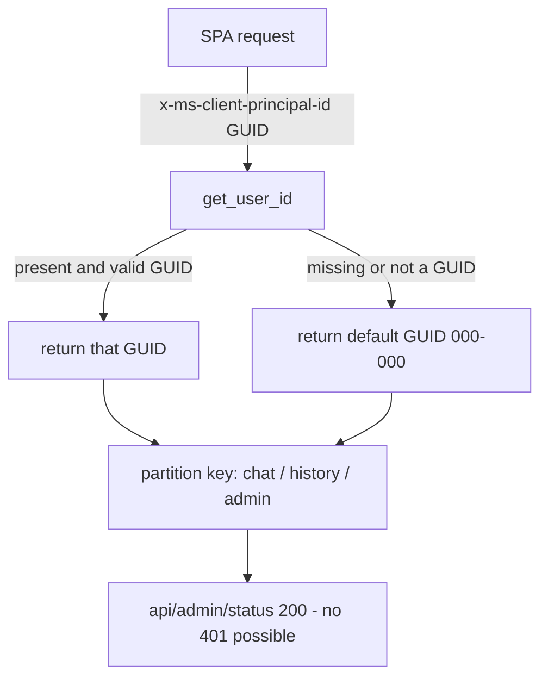

<!-- markdownlint-disable-file -->
# Task Research: BUG-0090 — Admin 401 & user_id header handling

Investigate BUG-0090 (prod admin panel returns 401 on `/api/admin/status`), pin the exact origin of the 401, and design the minimal user_id-header contract the user described: the backend only checks that a `user_id` header is present and is a valid GUID — nothing more. Mirror MACAE, and remove the Easy Auth role gate that produces the 401.

## Task Implementation Requests

* Investigate BUG-0090 and correct its (now stale) analysis.
* Establish the intended behavior:
  * Frontend auth ENABLED → real `user_id` (Entra `oid`) + real user initials collected.
  * Frontend auth DISABLED → `user_id` = a default GUID, initial = `G`.
  * Frontend always passes `user_id` in request headers (default or real).
  * Backend ONLY checks: `user_id` header present AND is a valid GUID. Nothing else.
* Explain the `/api/admin/status` 401 and remove that gate (it "shouldn't even exist").
* Mirror how MACAE handles `user_id` at the backend.
* Remove any extra safety / behavior beyond the minimal user_id-GUID check.

## Scope and Success Criteria

* Scope:
  * Backend user_id extraction + admin auth gate (`v2/src/backend/dependencies.py`, `routers/admin.py`).
  * Backend settings flag `require_admin_auth` and `environment`-based auth branching.
  * Frontend user_id header emission + default GUID / `G` initial (verify — no change expected).
  * MACAE backend user_id pattern (read-only reference).
  * BUG-0090 registry-entry accuracy vs. current Container-App topology.
  * Infra: whether Bicep sets `AZURE_REQUIRE_ADMIN_AUTH` / `AZURE_ENVIRONMENT`.
  * EXCLUDES: provisioning Easy Auth / Entra app registrations (the fix deliberately avoids this), telemetry, unrelated bugs.
* Assumptions:
  * Frontend is a Container App (`ca-frontend-*`), not App Service (per BUG-0081 closure).
  * User wants to REMOVE the backend Easy Auth requirement and replace it with a simple header user_id + GUID check. Real authentication (when desired) is an ingress/proxy concern, not app code — matching MACAE.
* Success Criteria:
  * Root cause of the `/api/admin/status` 401 identified with file + line references. ✅
  * MACAE's user_id contract documented with source references. ✅
  * One recommended approach (minimal unified header user_id + GUID validation, role gate removed) specified with exact edit points. ✅
  * BUG-0090's stale analysis corrected against current topology. ✅

## Outline

1. Corrected BUG-0090 root cause (the 401 is an intentional Easy Auth role gate, not "no identity source").
2. Current backend wiring — two user_id extractors + the role gate.
3. Current frontend behavior — already matches intent (no change needed).
4. MACAE pattern — read header, fall back to default GUID, never 401, no GUID check.
5. Selected approach — collapse to ONE minimal `get_user_id` (present + valid GUID → use; else default GUID), delete the role gate + `require_admin_auth`.
6. Exact edit points, removed symbols, tests to change, Bicep change.
7. Security tradeoff (documented) + rejected alternatives (old BUG-0090 options A/B).

## Potential Next Research

* Confirm the exact Bicep site(s) that set `AZURE_REQUIRE_ADMIN_AUTH` / `AZURE_ENVIRONMENT` on `ca-backend-*` (grep `v2/infra/**`), so the planner can drop `AZURE_REQUIRE_ADMIN_AUTH` and confirm `AZURE_ENVIRONMENT` is still used elsewhere (telemetry/log config) before deciding whether to keep it.
  * Reasoning: after removing `require_admin_auth`, the env var it reads must not be left dangling; `environment` may still be consumed by non-auth code.
  * Reference: `v2/src/backend/core/settings.py`, `v2/infra/main.bicep`.
* Confirm whether `environment: Environment` is still referenced by any non-auth code path after the auth branching is removed (grep `settings.environment`), to decide if the whole field can be retired or must stay.
  * Reasoning: minimal-diff cleanup; avoid removing a field that logging/telemetry still needs.
  * Reference: `v2/src/backend/**`.

## Research Executed

### File Analysis

* .copilot-tracking/research/subagents/2026-07-02/bug-0090-backend-auth-wiring-research.md
  * Full map of `v2/src/backend/dependencies.py` (both extractors + role gate), the admin router, settings flags, downstream user_id consumers, and every test that must change.
* .copilot-tracking/research/subagents/2026-07-02/bug-0090-macae-user-id-pattern-research.md
  * MACAE `get_authenticated_user_details` contract: headers read, all-zeros fallback, never-401, no GUID validation, frontend header interceptor.
* .copilot-tracking/research/subagents/2026-07-02/bug-0090-frontend-user-id-research.md
  * CWYD v2 frontend already sends `x-ms-client-principal-id`, defaults to all-zeros GUID, renders `G` for Guest — already matches intent.

### Code Search Results

* `x-ms-client-principal-id` (`_PRINCIPAL_ID_HEADER`) — v2/src/backend/dependencies.py:319; read by both `get_user_id` and `requires_role._checker`.
* `x-ms-client-principal` (`_PRINCIPAL_HEADER`, base64 claims blob) — v2/src/backend/dependencies.py:320; read ONLY by the role gate; the SPA never sends it.
* `HTTPException(status_code=401 ...)` — dependencies.py:370, 379, 472, 482, 501 (the BUG-0090 401 is at :472).
* `require_admin_auth` — v2/src/backend/core/settings.py (~line 536, default `False`).
* `DEFAULT_USER_ID = "00000000-0000-0000-0000-000000000000"` — v2/src/frontend/src/api/auth.tsx:40.

### External Research

* MACAE repo (`microsoft/Multi-Agent-Custom-Automation-Engine-Solution-Accelerator`)
  * `src/backend/auth/auth_utils.py` → `get_authenticated_user_details`; `src/backend/auth/sample_user.py` → all-zeros sample principal; `src/App/src/api/httpClient.ts` → request interceptor sets `x-ms-client-principal-id`.
    * Source: [MACAE on GitHub](https://github.com/microsoft/Multi-Agent-Custom-Automation-Engine-Solution-Accelerator)

### Project Conventions

* Standards referenced: `.github/copilot-instructions.md` Hard Rules — #1 one-unit, #2 test-first, #10 structural-change confirmation (this refactor removes public symbols + a setting → needs user confirmation before implementation), #11 StrEnum/no-`Any`, #16 no process narrative in `v2/src/**`, #18 no env IDs, #19 durable bugs.md + worklog.
* Instructions followed: `.github/instructions/v2-backend.instructions.md`, `.github/instructions/v2-backend-core.instructions.md`.

## Key Discoveries

### Corrected BUG-0090 root cause (the registry entry is STALE)

The recorded root cause ("no Easy Auth identity source feeds the backend"; "Fix: wire a real identity source — (A) Container Apps Easy Auth on backend, or (B) reverse-proxy `/api/*`") describes the OLD split-host App Service topology and points at exactly the wrong fix under the user's directive.

**Actual mechanics (verified):** The 401 is the **admin role gate working as designed**. Admin routes attach `AdminUserIdDep = Depends(requires_role("admin"))`. `requires_role("admin")._checker` raises the BUG-0090 401 at v2/src/backend/dependencies.py:472:

```python
if not claims_raw:                       # x-ms-client-principal base64 claims blob
    if allow_open_admin:
        return _LOCAL_DEV_USER
    raise HTTPException(
        status_code=status.HTTP_401_UNAUTHORIZED,
        detail="Missing client principal claims; Easy Auth claims header required.",
    )
```

It fires ONLY when `allow_open_admin` is `False` (dependencies.py:458-461):

```python
allow_open_admin = (
    settings.environment is Environment.LOCAL
    or not settings.require_admin_auth
)
```

i.e. `environment == production` **AND** `require_admin_auth == True`. The SPA admin client forwards only `x-ms-client-principal-id` (the `-id` header), never the base64 `x-ms-client-principal` **claims** blob → `claims_raw` is empty → 401. **With the shipped code defaults (`environment=LOCAL`, `require_admin_auth=False`) the admin routes are OPEN** — the 401 only appears because the deployment set both `AZURE_ENVIRONMENT=production` and `AZURE_REQUIRE_ADMIN_AUTH=true`.

So the endpoint is fine; the **gate** it carries is the problem. The user is right: this 401 "shouldn't even exist."

### Current backend wiring — two extractors + one role gate (all in v2/src/backend/dependencies.py)

* **`get_user_id`** (:346-384, alias `UserIdDep` :387) — chat/history extractor. Reads `x-ms-client-principal-id`; validates against a broad **non-GUID** allowlist `[A-Za-z0-9._@-]{1,128}` (`_is_valid_principal_id`, :326-344); 401 on malformed (:370) or missing-with-wall-on (:379); else folds to `"local-dev"`.
* **`requires_role("admin")`** (:433-510, `REQUIRE_ADMIN_USER`/`AdminUserIdDep` :513-514) — admin gate. Reads the base64 claims blob, decodes it (`_decode_easy_auth_principal` :389-406), extracts roles (`_extract_roles` :408-431), requires the `"admin"` role (403 if absent :489), 401 on missing/malformed claims (:472, :482), 401 on missing id (:501).
* **No global auth middleware** — v2/src/backend/app.py:257-270 adds only CORS; auth is per-route via `Depends`.
* **No GUID validation anywhere** on user_id. `uuid.UUID(...)` is used only on **conversation** ids (postgres.py:397), never user_id.
* **Downstream:** user_id is the tenant partition key — Cosmos `partition_key=user_id` (cosmosdb.py:207), Postgres `WHERE user_id=$1` (postgres.py:384), and every history.py / conversation.py route. Any replacement MUST still return a non-empty `str`.

### Current frontend — already matches intent (NO change needed)

* Sends `x-ms-client-principal-id: <resolved id>` on every user-facing request via `userIdHeaders()` (v2/src/frontend/src/api/auth.tsx:33, ~100-107); consumed by streamChat.tsx, conversationHistory.tsx, admin.tsx, speech.tsx. user_id is header-only, never in the body.
* Auth OFF default: `DEFAULT_USER_ID = "00000000-0000-0000-0000-000000000000"` (auth.tsx:40) — a **valid GUID**. `getUserId()` returns the resolved id or this sentinel.
* Auth ON: Easy Auth `/.auth/me` → Entra `oid` claim (auth.tsx:60-83). No MSAL.
* `G` initial: no user → `"Guest"` → `userInitials("Guest")` → `"G"` (components/Header/userIdentity.tsx:14-69).
* No explicit FE auth on/off flag — auth is implicit (whether `/.auth/me` returns a principal). Only `VITE_*` var is `VITE_BACKEND_URL`.

The frontend's "always send header", "default GUID when anon", and "`G` initial" all already match the user's description. The all-zeros sentinel IS "a default GUID" — no per-session random GUID is needed or wanted.

### MACAE pattern (the model to mirror)

* `get_authenticated_user_details(request_headers)` in `src/backend/auth/auth_utils.py` reads `x-ms-client-principal-id` (+ name/idp/token). When the id header is absent it logs and falls back to `src/backend/auth/sample_user.py`'s `X-Ms-Client-Principal-Id = "00000000-0000-0000-0000-000000000000"`.
* **Never raises 401 at the helper** — silent fallback to the zero-GUID. Real auth enforcement is upstream at Easy Auth (the proxy), not in Python.
* **No GUID validation** — value passed through verbatim.
* Frontend sets `x-ms-client-principal-id` on every request via an httpClient interceptor; `getUserId()` returns `USER_ID ?? "00000000-0000-0000-0000-000000000000"`.
* No auth-gated admin-status endpoint; `/healthz` is gated only by an optional `?code=` password.

CWYD's frontend already matches this. CWYD's backend diverges by adding the role gate + broad allowlist + environment branching — exactly the "extra safety" the user wants removed. The one place CWYD should go slightly beyond MACAE is the user's explicit ask for **GUID validation** (MACAE has none).

### Complete Examples

```python
# v2/src/backend/dependencies.py  (replaces get_user_id + the entire requires_role gate)

import uuid
from fastapi import Request

_PRINCIPAL_ID_HEADER = "x-ms-client-principal-id"
_DEFAULT_USER_ID = "00000000-0000-0000-0000-000000000000"  # anon default GUID (matches FE + MACAE)


def _is_valid_guid(value: str) -> bool:
    try:
        uuid.UUID(value)
        return True
    except ValueError:
        return False


def get_user_id(request: Request) -> str:
    """Return the caller's user id from the trusted identity header.

    Present + valid GUID -> use it; otherwise fall back to the anonymous
    default GUID. Never raises: identity enforcement (when enabled) is an
    ingress/proxy concern, not app code (matches MACAE).
    """
    raw = request.headers.get(_PRINCIPAL_ID_HEADER, "").strip()
    if raw and _is_valid_guid(raw):
        return raw
    return _DEFAULT_USER_ID


UserIdDep = Annotated[str, Depends(get_user_id)]
```

Admin routes then use the SAME `UserIdDep` — `AdminUserIdDep` is deleted.

### API and Schema Documentation

* Header contract (unchanged wire shape): `x-ms-client-principal-id: <GUID>` on every `/api/*` request. Body shape unchanged (`{ messages, conversation_id? }` — user_id is header-only).
* `/api/admin/status` response model (`AdminStatus`) and its leak guard are unchanged; only the dependency that gates it changes.

### Configuration Examples

* After the refactor, Bicep must **stop setting `AZURE_REQUIRE_ADMIN_AUTH`** on `ca-backend-*` (the flag no longer exists). `AZURE_ENVIRONMENT=production` may remain if still consumed by non-auth code (telemetry/log config) — confirm via grep before removing.

## Technical Scenarios

### Selected: collapse to ONE minimal user_id dependency (present + valid GUID → use; else default GUID); delete the role gate

The backend keeps a single `get_user_id` used by chat, history, AND admin. It reads `x-ms-client-principal-id`, and returns it iff it is a valid GUID, else the anonymous default GUID `00000000-0000-0000-0000-000000000000`. It **never raises**. `/api/admin/status` (and every admin route) swaps `AdminUserIdDep` → `UserIdDep`, so the 401 is impossible. Identity enforcement, when the operator "enables authentication", happens at the frontend/ingress layer (Easy Auth injecting/overwriting the header), never in app code — exactly the MACAE posture and the user's mental model.

**Requirements:**

* Read `x-ms-client-principal-id`; validate GUID; fall back to default GUID; never 401.
* Return a non-empty `str` (preserves the Cosmos/Postgres partition-key contract).
* All admin routes use the unified dependency (no role gate).

**Preferred Approach:**

* One-unit-per-turn (Hard Rule #1) sequencing across turns:
  1. Rewrite `get_user_id` to the minimal GUID-validated form + update its tests (Hard Rule #2).
  2. Point admin routes at `UserIdDep`; delete `AdminUserIdDep`/`REQUIRE_ADMIN_USER` usage + update `test_admin.py` override.
  3. Delete the now-dead `requires_role`, `_checker`, `_decode_easy_auth_principal`, `_extract_roles`, `_is_valid_principal_id`, and the `require_admin_auth` setting (cleanup-before-next-step / reduce-code-debt) + remove their tests.
  4. Drop `AZURE_REQUIRE_ADMIN_AUTH` from Bicep; confirm `AZURE_ENVIRONMENT` fate.
  5. Correct the BUG-0090 registry row + worklog (Hard Rule #19).

```text
v2/src/backend/dependencies.py        # rewrite get_user_id; delete role gate + helpers + broad allowlist
v2/src/backend/routers/admin.py       # AdminUserIdDep -> UserIdDep on all /api/admin/* routes
v2/src/backend/core/settings.py       # remove require_admin_auth (and possibly environment auth use)
v2/tests/backend/test_dependencies.py # replace requires_role suite; rewrite get_user_id cases for GUID rule
v2/tests/backend/test_admin.py        # override UserIdDep instead of REQUIRE_ADMIN_USER
v2/tests/backend/core/test_settings.py# drop test_require_admin_auth_defaults_to_false
v2/infra/main.bicep                   # stop setting AZURE_REQUIRE_ADMIN_AUTH on ca-backend-*
v2/docs/bugs.md                       # correct BUG-0090 root cause + fix
v2/docs/worklog/2026-07-02.md         # log the change
```



**Implementation Details:**

* Symbols to DELETE (dead after the swap): `requires_role`, its `_checker`, `_decode_easy_auth_principal`, `_extract_roles`, `_is_valid_principal_id`, `_PRINCIPAL_HEADER`, `_ROLE_TYP_SHORT`/`_ROLE_TYP_FULL`, `_LOCAL_DEV_USER` (replaced by the default GUID), `REQUIRE_ADMIN_USER`, `AdminUserIdDep`, and the `require_admin_auth` setting field. Verify zero non-test callers before deleting (grep tree).
* `environment: Environment` — likely still used by telemetry/log config; keep unless grep proves it dead. Do NOT remove the field just for auth reasons.
* Tests: test_dependencies.py:126-340 (whole `requires_role_*` suite deleted; `get_user_id` cases rewritten to assert present-valid-GUID → returns it, missing → default GUID, present-non-GUID → default GUID); test_admin.py:191 override → `UserIdDep`; test_settings.py:130 deleted.

```python
# v2/tests/backend/test_dependencies.py  (new get_user_id contract)
def test_get_user_id_returns_header_guid_when_valid():
    req = _request({"x-ms-client-principal-id": "3f2504e0-4f89-41d3-9a0c-0305e82c3301"})
    assert get_user_id(req) == "3f2504e0-4f89-41d3-9a0c-0305e82c3301"

def test_get_user_id_falls_back_to_default_when_missing():
    assert get_user_id(_request({})) == "00000000-0000-0000-0000-000000000000"

def test_get_user_id_falls_back_to_default_when_not_a_guid():
    assert get_user_id(_request({"x-ms-client-principal-id": "not-a-guid"})) == "00000000-0000-0000-0000-000000000000"
```

#### Considered Alternatives

* **Alt A — Old BUG-0090 Option A: wire Container Apps Easy Auth on the backend + Entra app registration with an `admin` role.** REJECTED. Directly contradicts the user's directive ("any other behavior or extra safety is unnecessary"; the 401 "shouldn't even exist"). Adds structural infra + Entra provisioning, keeps the heavy role gate, and does not match MACAE (which enforces at the proxy, not per-route in Python).
* **Alt B — Old BUG-0090 Option B: reverse-proxy `/api/*` through the frontend and reuse its Easy Auth + `admin` role.** REJECTED. Same reasons as Alt A plus new proxy plumbing in `frontend_app.py`. The frontend is now a Container App, so this option is also topology-stale.
* **Alt C — Keep both extractors; only relax `/api/admin/status` to `UserIdDep`.** REJECTED as insufficient. Leaves the role gate on admin WRITE routes and the broad non-GUID allowlist, so the backend still does "extra safety" the user asked to remove and still 401s on writes. The user's statement is a general contract ("the backend should only check … present + valid GUID"), so it must apply uniformly.
* **Alt D — On present-but-invalid GUID, return 400 (strict) instead of falling back to default.** VIABLE MINOR VARIANT, not selected as primary. It is a purer reading of "check it is a valid guid", but it introduces an error path MACAE does not have, and the frontend guarantees a valid GUID so it never triggers in practice. Surfaced as the single decision point for the planner/user to confirm (fallback-to-default vs. hard-400).

### Documented security tradeoff (must be stated to the user)

`x-ms-client-principal-id` is a **client-set, forgeable** header. After this change, any caller who can reach the backend FQDN can present any GUID and call admin routes (read AND write). This is acceptable ONLY because: (a) it exactly matches MACAE's posture; (b) user_id is a history-partition key, not a secrets boundary; (c) the user's model is that real auth is turned on at the **frontend/ingress** ("enable authentication to the frontend, enable the identity provider"), where Easy Auth injects/overwrites the header at the proxy. The durable protection for admin-write exposure is therefore **network/ingress-level** (private backend ingress, or Easy Auth at the Container App ingress the operator opts into) — NOT app-code role gates. The planner should record this tradeoff in the ADR/bug so the choice is explicit and informed.
