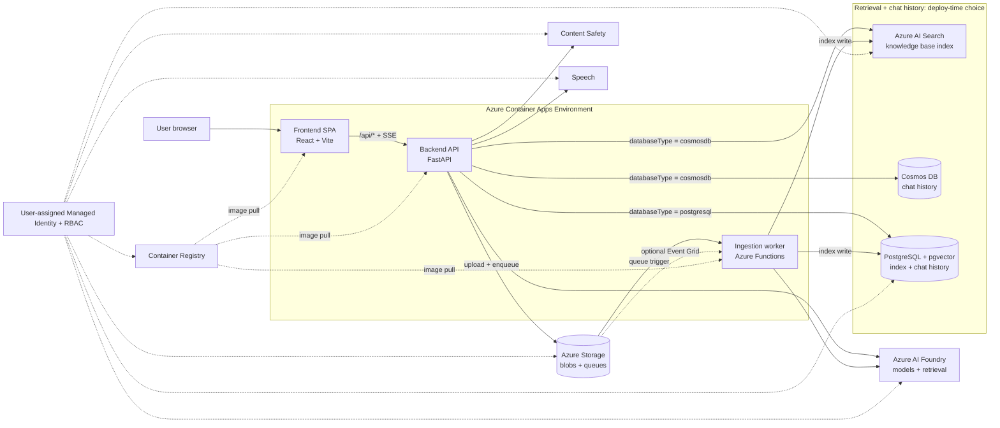

<!-- YAML front-matter schema: https://review.learn.microsoft.com/en-us/help/contribute/samples/process/onboarding?branch=main#supported-metadata-fields-for-readmemd -->

# Chat with Your Data

Ground a conversational assistant in your own documents and get answers with inline citations back to the source.

Organizations hold vast unstructured knowledge in contracts, policies, product manuals, and benefit guides that is hard to search and slow to answer questions from. Chat with Your Data indexes that content and puts a natural-language chat experience in front of it, so people find grounded answers in seconds instead of digging through files. Everything deploys into your own Azure subscription with a single `azd up`.

<br/>

<div align="center">

[**SOLUTION OVERVIEW**](#solution-overview) &nbsp;|&nbsp; [**QUICK DEPLOY**](#quick-deploy) &nbsp;|&nbsp; [**BUSINESS SCENARIO**](#business-scenario) &nbsp;|&nbsp; [**SUPPORTING DOCUMENTATION**](#supporting-documentation)

</div>

<br/>

> [!NOTE]
> With any AI solution you create using these templates, you are responsible for assessing all associated risks and complying with all applicable laws and safety standards. This accelerator is a starting point, not a turnkey production system. Evaluate retrieval quality, answer accuracy, and responsible-AI considerations against your own data before you rely on it. See the [Responsible AI Transparency FAQ](#responsible-ai-transparency-faq).

## Solution overview

### Architecture



The solution runs entirely on Azure Container Apps: a React single-page app, a FastAPI backend, and an Azure Functions ingestion worker. The backend calls Azure AI Foundry for models and retrieval, and reads and writes its index and chat history in either Azure AI Search with Cosmos DB or PostgreSQL with pgvector, chosen at deploy time. A user-assigned managed identity authorizes every call through Azure RBAC, so there is no Key Vault and there are no application secrets to manage.

### How it works

You ask a question in natural language. The backend retrieves the most relevant passages from your indexed documents, grounds a language model on that context, and streams the answer back to the browser with inline citations to the source documents. Ingestion runs separately: documents you upload or web pages you point at are parsed, chunked, embedded, and written to the retrieval index, ready for the next question.

### Additional resources

- [Azure AI Foundry documentation](https://learn.microsoft.com/azure/ai-foundry/)
- [Azure Container Apps documentation](https://learn.microsoft.com/azure/container-apps/)
- [Azure Functions documentation](https://learn.microsoft.com/azure/azure-functions/)
- [Azure Developer CLI (azd) documentation](https://learn.microsoft.com/azure/developer/azure-developer-cli/)

## Features

### Key features

<details open>
<summary>Click to learn more about the key features this solution enables</summary>

- Responses are grounded in your indexed content with inline citations back to the source documents.
- Upload files or index public web pages through a document ingestion pipeline that parses, chunks, and embeds many [supported file types](docs/supported_file_types.md).
- Choose Azure AI Search with Cosmos DB or PostgreSQL with pgvector as your retrieval and persistence engine, selected at deploy time.
- Choose between two interchangeable orchestrators, Agent Framework or LangGraph, that share the same retrieval and grounding pipeline and are selected at deploy time.
- A collapsible reasoning panel shows the model's intermediate steps alongside the answer as they stream in.
- Azure AI Content Safety screens prompts and responses to help keep the experience within your policy boundaries.
- A single user-assigned managed identity and Azure RBAC authorize every downstream call, with no Key Vault and no application secrets to manage. See [Managed identity and RBAC](docs/managed_identity.md).
- A single-page chat interface streams answers to the browser and retains [chat history](docs/chat_history.md) across sessions.
- An [admin experience](docs/admin.md) lets you ingest, inspect, and configure your dataset and prompts without touching code.
- Voice input is available through [speech-to-text](docs/speech_to_text.md) on any supported browser.
- Optional end-user sign-in secures the web app through Microsoft Entra ID. See [Authentication setup](docs/authentication_setup.md).

</details>

<br/>

## Quick deploy

### How to install or deploy

Follow the quick deploy steps on the deployment guide to deploy this solution to your own Azure subscription. [Click here to launch the deployment guide](docs/DeploymentGuide.md)

| [](https://codespaces.new/Azure-Samples/chat-with-your-data-solution-accelerator) | [](https://vscode.dev/redirect?url=vscode://ms-vscode-remote.remote-containers/cloneInVolume?url=https://github.com/Azure-Samples/chat-with-your-data-solution-accelerator) | [](https://vscode.dev/github/Azure-Samples/chat-with-your-data-solution-accelerator) |
|---|---|---|

> [!NOTE]
> Some tenants may have additional security restrictions that run periodically and could impact the application (for example, blocking public network access). If you experience issues or the application stops working, check if these restrictions are the cause. Consider deploying the WAF-supported version to ensure compliance. To configure, see the [post-deployment hardening guide](docs/AVMPostDeploymentGuide.md).

> [!IMPORTANT]
> Check Azure OpenAI quota availability before deploying. Follow the [quota check instructions guide](docs/QuotaCheck.md) to confirm sufficient capacity in your subscription.

### After you deploy

Once `azd up` finishes, it prints the web app URL. Open it, then:

1. Go to the [admin experience](docs/admin.md) to upload documents or index web pages so the assistant has content to ground on.
2. Wait for ingestion to finish, then return to the chat page and ask a question about your data.
3. Confirm answers include inline citations that link back to the source documents.

### Clean up

Remove every resource this accelerator created:

```bash
azd down
```

## Guidance

### Prerequisites and costs

To deploy this solution accelerator, ensure you have access to an [Azure subscription](https://azure.microsoft.com/free/) with the necessary permissions to create resource groups, resources, app registrations, and assign roles at the resource group level. You need Contributor role at the subscription level and Role Based Access Control role on the subscription or resource group level. Follow the steps in [Azure Account Set Up](docs/azure_account_setup.md).

Example regions where the required services are available: East US, East US 2, Australia East, UK South, France Central.

Check the [Azure Products by Region](https://azure.microsoft.com/explore/global-infrastructure/products-by-region/?products=all&regions=all) page and select a region where all required services are available.

Pricing varies by region and usage, so it is not possible to predict exact costs. Use the [Azure pricing calculator](https://azure.microsoft.com/pricing/calculator/) to estimate your costs and review the per-service pricing table below.

> [!IMPORTANT]
> Resources continue to incur charges until you delete them. Run `azd down` when you are finished to avoid ongoing costs.

## Resources

| Service | Purpose | Pricing |
|---------|---------|---------|
| [Azure Container Apps](https://learn.microsoft.com/azure/container-apps/) | Hosts the web app, backend API, and ingestion worker. | [Pricing](https://azure.microsoft.com/pricing/details/container-apps/) |
| [Azure Container Registry](https://learn.microsoft.com/azure/container-registry/) | Stores the container images the workload pulls. | [Pricing](https://azure.microsoft.com/pricing/details/container-registry/) |
| [Azure AI Foundry](https://learn.microsoft.com/azure/ai-foundry/) | Chat, embedding, and retrieval models. | [Pricing](https://azure.microsoft.com/pricing/details/cognitive-services/openai-service/) |
| [Azure AI Search](https://learn.microsoft.com/azure/search/) | Retrieval index in `cosmosdb` mode. | [Pricing](https://azure.microsoft.com/pricing/details/search/) |
| [Azure Document Intelligence](https://learn.microsoft.com/azure/ai-services/document-intelligence/) | Parses uploaded documents. | [Pricing](https://azure.microsoft.com/pricing/details/ai-document-intelligence/) |
| [Azure Storage](https://learn.microsoft.com/azure/storage/) | Stores ingestion blobs and processing queues. | [Pricing](https://azure.microsoft.com/pricing/details/storage/blobs/) |
| [Azure Functions](https://learn.microsoft.com/azure/azure-functions/) | Runs the ingestion pipeline. | [Pricing](https://azure.microsoft.com/pricing/details/functions/) |
| [Azure Cosmos DB](https://learn.microsoft.com/azure/cosmos-db/) | Chat history in `cosmosdb` mode. | [Pricing](https://azure.microsoft.com/pricing/details/cosmos-db/) |
| [Azure Database for PostgreSQL](https://learn.microsoft.com/azure/postgresql/) | Index and chat history in `postgresql` mode. | [Pricing](https://azure.microsoft.com/pricing/details/postgresql/flexible-server/) |
| [Azure AI Speech](https://learn.microsoft.com/azure/ai-services/speech-service/) | Speech-to-text input. | [Pricing](https://azure.microsoft.com/pricing/details/cognitive-services/speech-services/) |
| [Azure Monitor / Application Insights](https://learn.microsoft.com/azure/azure-monitor/) | Optional monitoring and diagnostics. | [Pricing](https://azure.microsoft.com/pricing/details/monitor/) |

<br/>

## Business scenario

|  |
|---|

Organizations hold large volumes of unstructured content including contracts, policies, and internal documentation that employees must search manually to answer questions or complete work. Chat with Your Data ingests that content and provides a grounded chat interface so employees and professionals get accurate, cited answers in seconds.

> [!NOTE]
> The sample data shipped with this accelerator is synthetic and generated using Azure OpenAI Service. It is intended for demonstration purposes only.

### Business value

<details>
<summary>Click to learn more about the value this solution provides</summary>

- Employees get accurate, grounded answers immediately instead of spending time searching through documents manually.
- Inline citations let users verify answers against source material, reducing the risk of acting on incorrect information.
- The admin experience lets teams configure personas, tune system prompts, and update the knowledge base without engineering involvement.
- A modular, plug-and-play architecture supports swapping retrieval backends and orchestrators so teams adapt the solution to their own infrastructure with minimal code changes.
- Deployment to your own Azure subscription keeps your data under your control and within your compliance boundary.

</details>

### Use cases

<details>
<summary>Click to learn more about the use cases this solution provides</summary>

| Use case | Persona | Challenges | Summary |
|---|---|---|---|
| Contract review and summarization | Legal professional, compliance officer | Reading and extracting key terms from large document sets is slow and error-prone. | Index contracts and enable users to query them in natural language, surfacing obligations, deadlines, and clauses with citations. See [Contract Review and Summarization Assistant](docs/contract_assistance.md). |
| Employee and HR assistance | HR professional, employee | Finding the right policy documents or benefits information across large knowledge bases takes too long. | Index HR policies and employee handbooks, then answer questions with citations to the source document. See [Employee Assistant](docs/employee_assistance.md). |
| Customer intelligence | Customer success manager, analyst | Synthesizing account history and customer feedback from unstructured notes is time-consuming. | Ground the assistant on customer-facing documents and notes, making account context instantly accessible. See [Customer truth](docs/customer_truth.md). |

</details>

<br/>

## Supporting documentation

### Documentation index

| Guide | What it covers |
|-------|----------------|
| [Architecture overview](docs/architecture.md) | How the solution is composed on Azure. |
| [Deployment guide](docs/DeploymentGuide.md) | Full `azd up` walkthrough and verification. |
| [Customize azd parameters](docs/customizing_azd_parameters.md) | Parameters to set before deploying. |
| [Local development](docs/LocalDevelopmentSetup.md) | Run the stack locally with Docker Compose. |
| [Admin and configuration](docs/admin.md) | Ingest, inspect, and configure your data and prompts. |
| [Document ingestion](docs/document_ingestion.md) | How documents are parsed, chunked, and indexed. |
| [Supported file types](docs/supported_file_types.md) | File formats the pipeline accepts. |
| [Streaming responses](docs/streaming_responses.md) | How answers stream to the browser over SSE. |
| [Chat history](docs/chat_history.md) | How conversations are stored and retrieved. |
| [Best practices](docs/best_practices.md) | Retrieval, chunking, and production guidance. |
| [Managed identity and RBAC](docs/managed_identity.md) | The identity model and role assignments. |
| [Authentication setup](docs/authentication_setup.md) | Add end-user sign-in to the web app. |
| [Model configuration](docs/model_configuration.md) | Configure models and prompts. |
| [Model quota settings](docs/azure_openai_model_quota_settings.md) | Manage Azure AI Foundry model quota. |
| [Quota check](docs/QuotaCheck.md) | Verify model capacity before deploying. |
| [PostgreSQL option](docs/postgreSQL.md) | Deploy with PostgreSQL and pgvector. |
| [Speech-to-text](docs/speech_to_text.md) | Voice input configuration. |
| [Post-deployment hardening](docs/AVMPostDeploymentGuide.md) | WAF-aligned post-deployment steps. |
| [Troubleshooting](docs/TroubleShootingSteps.md) | Common issues and fixes. |
| [Responsible AI FAQ](docs/transparency_faq.md) | Responsible-AI transparency information. |

### Security guidelines

Chat with Your Data authenticates to Azure with a single user-assigned managed identity, and every downstream call is authorized through Azure RBAC. There is no Key Vault and there are no application secrets to store or rotate. See [Managed identity and RBAC](docs/managed_identity.md) for the identity model and role assignments.

Additional security considerations include:

- Enabling [GitHub secret scanning](https://docs.github.com/code-security/secret-scanning/about-secret-scanning) on any fork of this repository so credentials are never accidentally committed.
- Enabling the private-networking hardening flag at deploy time to place data-plane resources behind a virtual network and private endpoints for stricter isolation.
- Enabling [Microsoft Defender for Cloud](https://learn.microsoft.com/azure/defender-for-cloud) for continuous posture monitoring.

### Cross references

Check out similar solution accelerators:

| Solution accelerator | Description |
|---|---|
| [Document knowledge mining](https://github.com/microsoft/Document-Knowledge-Mining-Solution-Accelerator) | Identify relevant documents, summarize unstructured information, and generate document templates. |
| [Conversation knowledge mining](https://github.com/microsoft/Conversation-Knowledge-Mining-Solution-Accelerator) | Gain actionable insights from large volumes of conversational data by identifying key themes, patterns, and relationships. |
| [Content processing](https://github.com/microsoft/document-generation-solution-accelerator) | Extract data from multi-modal content, map it to schemas with confidence scoring, and enable accurate processing of documents like contracts, claims, and invoices. |

Want to learn more about Microsoft's AI and Data Engineering best practices? Check out our playbooks:

| Playbook | Description |
|---|---|
| [AI playbook](https://learn.microsoft.com/ai/playbook/) | Solutions, capabilities, and code developed to solve real-world AI problems. |
| [Data playbook](https://learn.microsoft.com/data-engineering/playbook/understanding-data-playbook) | Enterprise software engineering solutions developed with and validated by Microsoft's largest customers and partners. |

## Provide feedback

Found a problem or have an idea? [Open an issue](https://github.com/Azure-Samples/chat-with-your-data-solution-accelerator/issues) in this repository.

## Responsible AI Transparency FAQ

Review how this accelerator handles responsible-AI considerations in the [Responsible AI Transparency FAQ](docs/transparency_faq.md).

## License

This repository is licensed under the [MIT License](LICENSE.md). The dataset under the `data/` folder is licensed under the [CDLA-Permissive-2 License](CDLA-Permissive-2.md).

## Disclaimers
This Software requires the use of third-party components which are governed by separate proprietary or open-source licenses as identified below, and you must comply with the terms of each applicable license in order to use the Software. You acknowledge and agree that this license does not grant you a license or other right to use any such third-party proprietary or open-source components.

To the extent that the Software includes components or code used in or derived from Microsoft products or services, including without limitation Microsoft Azure Services (collectively, “Microsoft Products and Services”), you must also comply with the Product Terms applicable to such Microsoft Products and Services. You acknowledge and agree that the license governing the Software does not grant you a license or other right to use Microsoft Products and Services. Nothing in the license or this ReadMe file will serve to supersede, amend, terminate or modify any terms in the Product Terms for any Microsoft Products and Services.

You must also comply with all domestic and international export laws and regulations that apply to the Software, which include restrictions on destinations, end users, and end use. For further information on export restrictions, visit https://aka.ms/exporting.

You acknowledge that the Software and Microsoft Products and Services (1) are not designed, intended or made available as a medical device(s), and (2) are not designed or intended to be a substitute for professional medical advice, diagnosis, treatment, or judgment and should not be used to replace or as a substitute for professional medical advice, diagnosis, treatment, or judgment. Customer is solely responsible for displaying and/or obtaining appropriate consents, warnings, disclaimers, and acknowledgements to end users of Customer’s implementation of the Online Services.

You acknowledge the Software is not subject to SOC 1 and SOC 2 compliance audits. No Microsoft technology, nor any of its component technologies, including the Software, is intended or made available as a substitute for the professional advice, opinion, or judgement of a certified financial services professional. Do not use the Software to replace, substitute, or provide professional financial advice or judgment.

BY ACCESSING OR USING THE SOFTWARE, YOU ACKNOWLEDGE THAT THE SOFTWARE IS NOT DESIGNED OR INTENDED TO SUPPORT ANY USE IN WHICH A SERVICE INTERRUPTION, DEFECT, ERROR, OR OTHER FAILURE OF THE SOFTWARE COULD RESULT IN THE DEATH OR SERIOUS BODILY INJURY OF ANY PERSON OR IN PHYSICAL OR ENVIRONMENTAL DAMAGE (COLLECTIVELY, “HIGH-RISK USE”), AND THAT YOU WILL ENSURE THAT, IN THE EVENT OF ANY INTERRUPTION, DEFECT, ERROR, OR OTHER FAILURE OF THE SOFTWARE, THE SAFETY OF PEOPLE, PROPERTY, AND THE ENVIRONMENT ARE NOT REDUCED BELOW A LEVEL THAT IS REASONABLY, APPROPRIATE, AND LEGAL, WHETHER IN GENERAL OR IN A SPECIFIC INDUSTRY. BY ACCESSING THE SOFTWARE, YOU FURTHER ACKNOWLEDGE THAT YOUR HIGH-RISK USE OF THE SOFTWARE IS AT YOUR OWN RISK.
