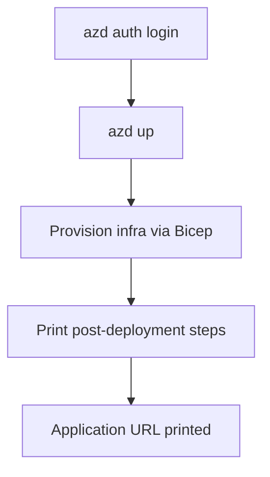

[Back to *Chat with your data* README](../README.md)

# Deployment Guide

## Overview

This guide walks you through deploying Chat with Your Data to Azure. The deployment takes approximately 25-30 minutes for the default configuration and includes infrastructure provisioning, container image builds, and application setup.

> [!TIP]
> If you encounter any issues during deployment, check the [Troubleshooting Guide](./TroubleShootingSteps.md) for solutions to common problems.

> [!NOTE]
> Some tenants may have additional security restrictions that run periodically and could impact the application (for example, blocking public network access). If you experience issues or the application stops working, check if these restrictions are the cause. Consider deploying the WAF-supported version to ensure compliance. To configure, see [Section 3.1](#31-choose-deployment-type-optional).

## Step 1: Prerequisites & Setup

### 1.1 Azure account requirements

Ensure you have access to an [Azure subscription](https://azure.microsoft.com/free/) with the following permissions:

| Required permission/role | Scope | Purpose |
|--------------------------|-------|---------|
| Contributor | Subscription level | Create and manage Azure resources |
| User Access Administrator | Subscription level | Manage user access and role assignments |
| Role Based Access Control Admin | Subscription/Resource Group level | Configure RBAC permissions |

For detailed setup instructions, follow [Azure Account Set Up](./azure_account_setup.md).

### 1.2 Check service availability & quota

Before proceeding, ensure your chosen region has all required services available:

**Required Azure services:**

- [Azure AI Foundry](https://learn.microsoft.com/azure/ai-foundry/)
- [Azure OpenAI Service](https://learn.microsoft.com/azure/ai-services/openai/)
- [Azure AI Search](https://learn.microsoft.com/azure/search/) (`cosmosdb` mode only)
- [Azure Container Apps](https://learn.microsoft.com/azure/container-apps/)
- [Azure Container Registry](https://learn.microsoft.com/azure/container-registry/)
- [Azure Functions](https://learn.microsoft.com/azure/azure-functions/)
- [Azure Document Intelligence](https://learn.microsoft.com/azure/ai-services/document-intelligence/)
- [Azure Cosmos DB](https://learn.microsoft.com/azure/cosmos-db/) (`cosmosdb` mode)
- [Azure Database for PostgreSQL](https://learn.microsoft.com/azure/postgresql/) (`postgresql` mode)

**Recommended regions:** East US, East US 2, Australia East, UK South, France Central

Check the [Azure Products by Region](https://azure.microsoft.com/explore/global-infrastructure/products-by-region/?products=all&regions=all) page to verify service availability in your target region.

### 1.3 Quota check (recommended)

Check your Azure OpenAI quota availability before deployment. Follow the [Quota Check Instructions](./QuotaCheck.md) to ensure sufficient model capacity, then review [Azure OpenAI Model Quota Settings](./azure_openai_model_quota_settings.md) to adjust if needed.

## Step 2: Choose Your Deployment Environment

Select one of the following options to set up your deployment environment:

### Environment comparison

| Option | Best for | Prerequisites | Setup time |
|--------|----------|---------------|------------|
| GitHub Codespaces | Quick deployment, no local setup required | GitHub account | 3-5 minutes |
| VS Code Dev Containers | Fast deployment with local tools | Docker Desktop, VS Code | 5-10 minutes |
| Visual Studio Code (Web) | Quick deployment, no local setup required | Azure account | 2-4 minutes |
| Local environment | Enterprise environments, full control | All tools individually | 15-30 minutes |

> [!TIP]
> For the fastest deployment, start with **GitHub Codespaces** — no local installation required.

---

<details>
<summary><b>Option A: GitHub Codespaces (Easiest)</b></summary>

[](https://codespaces.new/Azure-Samples/chat-with-your-data-solution-accelerator)

1. Click the badge above (may take several minutes to load)
2. Accept default values on the Codespaces creation page
3. Wait for the environment to initialize (includes all deployment tools)
4. Proceed to [Step 3: Configure Deployment Settings](#step-3-configure-deployment-settings)

</details>

<details>
<summary><b>Option B: VS Code Dev Containers</b></summary>

[](https://vscode.dev/redirect?url=vscode://ms-vscode-remote.remote-containers/cloneInVolume?url=https://github.com/Azure-Samples/chat-with-your-data-solution-accelerator)

> [!NOTE]
> macOS developers on Apple Silicon (ARM64): the Dev Container will **not** work due to a limitation with the Azure Functions Core Tools ([see issue](https://github.com/Azure/azure-functions-core-tools/issues/3112)). Use Option D (Local Environment) instead.

**Prerequisites:**

- [Docker Desktop](https://www.docker.com/products/docker-desktop/) installed and running
- [VS Code](https://code.visualstudio.com/) with the [Dev Containers extension](https://marketplace.visualstudio.com/items?itemName=ms-vscode-remote.remote-containers)

**Steps:**

1. Start Docker Desktop
2. Click the badge above to open in Dev Containers
3. Wait for the container to build and start (includes all deployment tools)
4. Proceed to [Step 3: Configure Deployment Settings](#step-3-configure-deployment-settings)

> [!TIP]
> VS Code should recognize the available dev container and prompt you to reopen the folder in it. For more details, see [Open an existing folder in a container](https://code.visualstudio.com/docs/remote/containers#_quick-start-open-an-existing-folder-in-a-container).

</details>

<details>
<summary><b>Option C: Visual Studio Code (Web)</b></summary>

[](https://vscode.dev/azure/?vscode-azure-exp=foundry&agentPayload=eyJiYXNlVXJsIjogImh0dHBzOi8vcmF3LmdpdGh1YnVzZXJjb250ZW50LmNvbS9BenVyZS1TYW1wbGVzL2NoYXQtd2l0aC15b3VyLWRhdGEtc29sdXRpb24tYWNjZWxlcmF0b3IvcmVmcy9oZWFkcy9tYWluL2luZnJhL3ZzY29kZV93ZWIiLCAiaW5kZXhVcmwiOiAiL2luZGV4Lmpzb24iLCAidmFyaWFibGVzIjogeyJhZ2VudElkIjogIiIsICJjb25uZWN0aW9uU3RyaW5nIjogIiIsICJ0aHJlYWRJZCI6ICIiLCAidXNlck1lc3NhZ2UiOiAiIiwgInBsYXlncm91bmROYW1lIjogIiIsICJsb2NhdGlvbiI6ICIiLCAic3Vic2NyaXB0aW9uSWQiOiAiIiwgInJlc291cmNlSWQiOiAiIiwgInByb2plY3RSZXNvdXJjZUlkIjogIiIsICJlbmRwb2ludCI6ICIifSwgImNvZGVSb3V0ZSI6IFsiYWktcHJvamVjdHMtc2RrIiwgInB5dGhvbiIsICJkZWZhdWx0LWF6dXJlLWF1dGgiLCAiZW5kcG9pbnQiXX0=)

1. Click the badge above (may take a few minutes to load)
2. Sign in with your Azure account when prompted
3. Wait for the environment to initialize
4. Authenticate with Azure using device code authentication:

   ```shell
   az login --use-device-code
   ```

   > [!NOTE]
   > In VS Code Web, the regular `az login` command may fail. Use the `--use-device-code` flag to authenticate via browser device code flow.

5. Proceed to [Step 3: Configure Deployment Settings](#step-3-configure-deployment-settings)

</details>

<details>
<summary><b>Option D: Local Environment</b></summary>

**Required tools:**

- [VS Code](https://code.visualstudio.com/) with extensions:
  - [Azure Functions](https://marketplace.visualstudio.com/items?itemName=ms-azuretools.vscode-azurefunctions)
  - [Azure Tools](https://marketplace.visualstudio.com/items?itemName=ms-vscode.vscode-node-azure-pack)
  - [Bicep](https://marketplace.visualstudio.com/items?itemName=ms-azuretools.vscode-bicep)
  - [Pylance](https://marketplace.visualstudio.com/items?itemName=ms-python.vscode-pylance)
  - [Python](https://marketplace.visualstudio.com/items?itemName=ms-python.python)
- [Python 3.11](https://www.python.org/downloads/release/python-3119/)
- [Node.js LTS](https://nodejs.org/en)
- [Azure Developer CLI](https://learn.microsoft.com/azure/developer/azure-developer-cli/install-azd) (v1.18.0+, not v1.23.9)
- [Azure CLI](https://learn.microsoft.com/cli/azure/install-azure-cli) (v2.87.0+ required for post-deployment scripts)
- [Bicep CLI](https://learn.microsoft.com/azure/azure-resource-manager/bicep/install) (v0.33.0+)
- [Azure Functions Core Tools](https://docs.microsoft.com/azure/azure-functions/functions-run-local)
- [Git](https://git-scm.com/downloads)
- [PowerShell 7.0+](https://learn.microsoft.com/powershell/scripting/install/installing-powershell)

**Setup steps:**

1. Install all required tools listed above
2. Clone the repository:

   ```shell
   azd init -t chat-with-your-data-solution-accelerator
   ```

3. Open the project folder in your terminal
4. Run the environment setup script:

   ```bash
   .devcontainer/setupEnv.sh
   ```

5. Select the Python interpreter in VS Code:
   - Open the command palette (`Ctrl+Shift+P`)
   - Type `Python: Select Interpreter`
   - Select the Python 3.11 environment created by `uv`
6. Proceed to [Step 3: Configure Deployment Settings](#step-3-configure-deployment-settings)

**PowerShell users:** If you encounter script execution issues, run:

```powershell
Set-ExecutionPolicy -Scope Process -ExecutionPolicy Bypass
```

</details>

## Step 3: Configure Deployment Settings

Review the configuration options below. You can customize any settings that meet your needs, or leave them as defaults to proceed with a standard deployment.

### 3.1 Choose Deployment Type (Optional)

| Aspect | Development/Testing (Default) | Production |
|--------|-------------------------------|------------|
| Configuration file | `main.parameters.json` (sandbox) | Copy `main.waf.parameters.json` to `main.parameters.json` |
| Security controls | Minimal (for rapid iteration) | Enhanced (production best practices) |
| Cost | Lower costs | Cost optimized |
| Use case | POCs, development, testing | Production workloads |
| Framework | Basic configuration | [Well-Architected Framework](https://learn.microsoft.com/azure/well-architected/) |
| Features | Core functionality | Reliability, security, operational excellence |

**To use production configuration:**

1. Navigate to the `infra` folder in your project
2. Open `main.waf.parameters.json` in a text editor
3. Select all content and copy it
4. Open `main.parameters.json` in the same editor
5. Replace all existing content with the copied content
6. Save the file

### 3.2 Set VM credentials (Optional — production only)

> [!NOTE]
> This section only applies if you selected **Production** deployment type in section 3.1. VMs are not deployed in the default Development/Testing configuration.

By default, random GUIDs are generated for VM credentials. To set custom credentials:

```shell
azd env set AZURE_ENV_VM_ADMIN_USERNAME <your-username>
azd env set AZURE_ENV_VM_ADMIN_PASSWORD <your-password>
```

### 3.3 Advanced configuration (Optional)

<details>
<summary><b>Configurable parameters</b></summary>

You can customize various deployment settings before running `azd up`, including Azure regions, AI model configurations (deployment type, version, capacity), container registry settings, and resource names.

See [Parameter Customization Guide](./customizing_azd_parameters.md) for the full list of available parameters and their usage.

These key parameters are environment-variable driven (not interactive prompts). Set any of them before running `azd up` with `azd env set <ENV_VAR> <value>`:

| Parameter (env var) | Values | Notes |
|---------------------|--------|-------|
| `databaseType` (`DATABASE_TYPE`) | `postgresql` (default), `cosmosdb` | Selects **both** the chat-history backend and the vector index store. `cosmosdb` deploys Cosmos DB + Azure AI Search; `postgresql` deploys PostgreSQL Flexible Server with pgvector (Azure AI Search is not deployed). Locked after deployment. |
| `ingestionTrigger` (`INGESTION_TRIGGER`) | `direct_enqueue` (default) | Document-ingestion trigger mode for the Functions app. |
| `azureAiServiceLocation` (`AZURE_AI_SERVICE_LOCATION`) | Azure region | Region for Azure AI Foundry models. Prompted during `azd up` if unset. |
| `enableMonitoring` (`ENABLE_MONITORING`) | `true`, `false` | Adds Log Analytics and Application Insights. Defaults to `false`. |
| `enableScalability` (`ENABLE_SCALABILITY`) | `true`, `false` | Higher SKUs and autoscaling. Defaults to `false` (dev) / `true` (production WAF). |
| `enableRedundancy` (`ENABLE_REDUNDANCY`) | `true`, `false` | Zone/region redundancy. Defaults to `false`. |
| `enablePrivateNetworking` (`ENABLE_PRIVATE_NETWORKING`) | `true`, `false` | Adds a virtual network, private DNS, and a bastion host. Defaults to `false` (dev) / `true` (production WAF). |

> [!NOTE]
> The `enable*` flags are wired through the production `main.waf.parameters.json`. When using the default `main.parameters.json` (development/testing), toggling them requires editing that file or switching to the WAF parameters file per [Section 3.1](#31-choose-deployment-type-optional).

</details>

<details>
<summary><b>Reuse existing resources</b></summary>

To optimize costs and integrate with your existing Azure infrastructure, you can configure the solution to reuse compatible resources already deployed in your subscription.

**Supported resources for reuse:**

- Log Analytics Workspace: integrate with your existing monitoring infrastructure by reusing an established Log Analytics workspace for centralized logging and monitoring.
- Resource Group: leverage an existing resource group to organize resources within your current Azure infrastructure. Follow the [setup steps here](./re-use-resource-group.md) before running `azd up`.

**Key benefits:**

- Eliminate duplicate resource charges by reusing existing services.
- Maintain unified monitoring across your Azure infrastructure.
- Skip resource creation for existing compatible services to speed up provisioning.
- Reduce the number of resources to manage and monitor.

**Important considerations:**

- Ensure existing resources meet the solution's requirements and are in compatible regions.
- Review access permissions and configurations before reusing resources.
- Consider the impact on existing workloads when sharing resources.

</details>

## Step 4: Deploy the Solution

> [!TIP]
> If you encounter any issues during deployment, check the [Troubleshooting Guide](./TroubleShootingSteps.md) for common solutions.

### 4.1 Authenticate with Azure

```shell
azd auth login
```

**For specific tenants:**

```shell
azd auth login --tenant-id <tenant-id>
```

> [!TIP]
> To find your Tenant ID: open the [Azure Portal](https://portal.azure.com/), navigate to **Microsoft Entra ID**, and copy the **Tenant ID** from the Overview page.

### 4.2 Start deployment

> [!NOTE]
> If you are running azd version 1.23.9, run the following command first:
>
> ```bash
> azd config set provision.preflight off
> ```

```shell
azd up
```

**During deployment, you will be prompted for:**

1. Environment name (e.g., `cwyd`) — must be 3-16 characters, alphanumeric only
2. Azure subscription selection
3. Location — the region where your infrastructure resources will be deployed
4. Resource group selection (create new or use existing)

**Expected duration:** 25-30 minutes for the default configuration

> [!NOTE]
> If you encounter errors or timeouts, try a different region as there may be capacity constraints. For detailed error solutions, see the [Troubleshooting Guide](./TroubleShootingSteps.md).

**What `azd up` does:**



`azd up` provisions the Azure infrastructure only. It does not build the application images or ingest data — those are manual steps you complete in [Step 5](#step-5-post-deployment-configuration).

1. Provisions the resource group contents described in [Architecture overview](architecture.md) using Bicep — Container Apps, container registry, Azure OpenAI, the search or database resources, and supporting services.
2. Creates the three Container Apps (frontend, backend, ingestion) running a temporary placeholder image.
3. Prints the post-deployment commands you run next to build the application images and configure the data plane.

### 4.3 Get application URL

After successful deployment, `azd` prints the application URL in the terminal. You can also locate it manually:

1. Open the [Azure Portal](https://portal.azure.com/)
2. Navigate to your resource group
3. Find the **Container Apps** — you will see the frontend, backend, and ingestion (function) services
4. Click the frontend Container App and copy its **Application URL** from the overview page

> [!IMPORTANT]
> Complete [Post-Deployment Steps](#step-5-post-deployment-configuration) before accessing the application.

### 4.4 Redeploy the application images

`azd up` provisions infrastructure only, so there is no `azd deploy` step for this accelerator. To rebuild the application images and roll out new revisions to all three Container Apps after code changes, re-run the container workflow described in [Step 5.1](#51-build-push-and-update-container-images-required).

## Step 5: Post-Deployment Configuration

### 5.1 Build, push, and update container images (Required)

`azd up` provisions the Container Apps with a temporary placeholder image. Run the combined container workflow to build the application images, push them to your Azure Container Registry, and roll out new revisions to all three Container Apps (frontend, backend, ingestion).

**Login to Azure CLI:**

```shell
az login
```

**For specific tenants:**

```shell
az login --tenant-id <tenant-id>
```

**PowerShell (Windows):**

```powershell
.\infra\scripts\post-provision\acr_build_push_update.ps1 -ResourceGroupName "<your-resource-group-name>"
```

**Bash (Linux/macOS/WSL):**

```bash
bash infra/scripts/post-provision/acr_build_push_update.sh -g "<your-resource-group-name>"
```

This script builds and pushes the images to your ACR using ACR Tasks (remote build — no local Docker required), updates each Container App to pull its image from your private ACR using managed-identity authentication, and restarts all services. It works for both standard and private-networking (WAF) deployments by temporarily unlocking the registry for the build and re-locking it afterwards.

> [!TIP]
> Pass a custom image tag with `-Tag <tag>` in PowerShell or `-t <tag>` in Bash (default: `latest`).

> [!NOTE]
> If you re-run `azd provision`, run this script again to restore the correct container images.

### 5.2 Run post-deployment setup script (Required)

Run the post-deployment script to complete data-plane setup. It auto-discovers the resources in your resource group and, based on `databaseType`:

* `postgresql` mode: enables the `vector` (pgvector) extension on the PostgreSQL Flexible Server. Tables are created automatically by the application at runtime.
* `cosmosdb` mode: creates the Azure AI Search index (`cwyd-index`) and seeds the Foundry IQ knowledge base used for retrieval.

For private-networking (WAF) deployments it temporarily enables public access, performs the setup, then restores the original network state.

> [!IMPORTANT]
> The post-deployment script requires **Azure CLI version 2.87.0 or later**. Check your installed version with `az version`. If it is earlier than 2.87.0, upgrade first with `az upgrade`.

**PowerShell (Windows):**

```powershell
.\infra\scripts\post-provision\post_deployment_setup.ps1 -ResourceGroupName "<your-resource-group-name>"
```

**Bash (Linux/macOS/WSL):**

```bash
bash infra/scripts/post-provision/post_deployment_setup.sh "<your-resource-group-name>"
```

> [!NOTE]
> The script auto-discovers all resources in the resource group. It handles private networking (WAF) deployments by temporarily enabling public access, performing the setup, then restoring the original state.

### 5.3 Configure authentication (Recommended)

The deployed app works without an identity provider, but it then treats every visitor as a single shared default user with no sign-in and no per-user history isolation. Configure authentication to require Microsoft Entra ID sign-in, give each user their own chat history, and control who can reach the admin area.

1. Follow [Set up authentication](./authentication_setup.md).
2. Allow a few minutes for the authentication changes to take effect.

### 5.4 Verify deployment

1. Access your application using the URL from Step 4.3
2. Confirm the application loads successfully
3. If you configured authentication in Step 5.3, verify you can sign in with your authenticated account

### 5.5 Test the application

1. Navigate to the admin experience at `/admin` on your application URL, upload documents via **Ingest Data**, and add your data. Sample data is available in the [`data/`](../data) directory.
2. Navigate to the chat application and start chatting on top of your data.

## Step 6: Clean Up (Optional)

### Remove all resources

```shell
azd down
```

> [!WARNING]
> `azd down` permanently deletes all deployed resources and ingested data. Export anything you need before running this command.

> [!NOTE]
> If you deployed with `enableRedundancy=true` and Log Analytics workspace replication is enabled, you must first disable replication before running `azd down`, otherwise the resource group delete will fail. Follow the steps in [Handling Log Analytics Workspace Deletion with Replication Enabled](./LogAnalyticsReplicationDisable.md), wait until replication returns `false`, then run `azd down`.

### Manual cleanup (if needed)

If deployment fails or you need to clean up manually, follow the [Delete Resource Group Guide](./delete_resource_group.md).

## Managing Multiple Environments

### Recover from failed deployment

<details>
<summary><b>Recover from failed deployment</b></summary>

If your deployment failed or encountered errors:

1. Try a different region by creating a new environment and selecting a different Azure region during deployment.
2. Clean up and retry: use `azd down` to remove failed resources, then `azd up` to redeploy.
3. Create a completely new environment with a different name for a fresh start.

**Example recovery workflow:**

```shell
# Remove failed deployment (optional)
azd down

# Create new environment (3-16 chars, alphanumeric only)
azd env new cwydretry

# Deploy with different settings/region
azd up
```

</details>

### Create a new environment

<details>
<summary><b>Create a new environment</b></summary>

If you need to deploy to a different region, test different configurations, or create additional environments:

```shell
# Create a new named environment (3-16 characters, alphanumeric only)
azd env new <new-environment-name>

# Select the new environment
azd env select <new-environment-name>

# Deploy to the new environment
azd up
```

> **Environment name requirements:**
> - Length: 3-16 characters
> - Characters: alphanumeric only (letters and numbers)
> - Valid examples: `cwyd`, `test123`, `myappdev`, `prod2024`
> - Invalid examples: `cd` (too short), `my-very-long-environment-name` (too long), `test_env` (underscore not allowed), `myapp-dev` (hyphen not allowed)

</details>

### Switch between environments

<details>
<summary><b>Switch between environments</b></summary>

```shell
# List all environments
azd env list

# Switch to a different environment
azd env select <environment-name>

# View current environment variables
azd env get-values
```

</details>

### Best practices for multiple environments

- Use descriptive names such as `cwyddev`, `cwydprod`, `cwydtest` (3-16 chars, alphanumeric only).
- Deploy to multiple regions for testing quota availability.
- Each environment can have different parameter settings.
- Use `azd down` to remove environments you no longer need and avoid unnecessary costs.

## Deploy using Bicep directly

If you prefer not to use `azd`, you can deploy using the Bicep file directly. A [Bicep file](../infra/main.bicep) is used to generate the [ARM template](../infra/main.json).

```sh
az deployment sub create --template-file ./infra/main.bicep --subscription {your_azure_subscription_id} --location {your_preferred_location}
```

## Next steps

- [Architecture overview](./architecture.md) — understand the system design and components
- [Admin and configuration](./admin.md) — ingest documents and configure prompts
- [Local development setup](./LocalDevelopmentSetup.md) — set up your local environment for debugging
- [Customize azd parameters](./customizing_azd_parameters.md) — advanced parameter customization
- [Troubleshooting](./TroubleShootingSteps.md) — common issues and fixes

## Need help?

- Check the [Troubleshooting Guide](./TroubleShootingSteps.md) for common issues.
- Open an issue in the [GitHub repository](https://github.com/Azure-Samples/chat-with-your-data-solution-accelerator/issues).
- Review the [Contributing Guide](../CONTRIBUTING.md) for development guidance.
