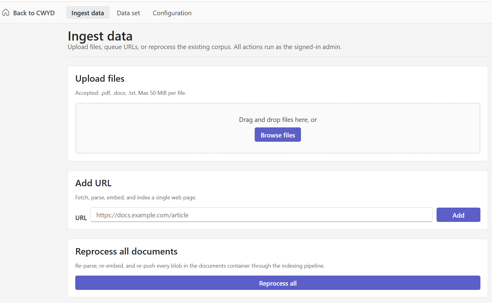

[Back to *Chat with your data* README](../README.md)

## Overview

Administration is part of the web app. There is no separate admin site to deploy or sign in to. When you have the admin role, an admin area appears in the same application under `/admin`, where you can ingest documents, remove them, and adjust application settings.

> [!NOTE]
> Replace the images below with screenshots of your deployment.

## Access control

The admin pages are gated on an `admin` role claim from the platform authentication layer. On load, the web app makes a one-time status check to confirm the current user has the role. Users without the role never see the admin area, and the backend rejects admin requests from callers who lack the role. See [App authentication setup](azure_app_service_auth_setup.md) for how to assign the role.

## Admin pages

The admin area has three pages.

| Page | Purpose |
|------|---------|
| Ingest | Upload documents or submit a URL to add content to the index. |
| Delete | Remove documents from the index and their source blobs. |
| Configuration | View and adjust application settings. |

## Ingest documents

Use the Ingest page to upload files or submit a URL. Uploaded content is stored, queued, and processed by the ingestion worker, which parses, chunks, embeds, and indexes it. For the pipeline details, see [Document ingestion](document_ingestion.md). For the file types you can upload, see [Supported file types](supported_file_types.md).

## Delete documents

Use the Delete page to remove a document from the index along with its source blob, so it no longer appears in chat answers or citations.

## Configuration

Use the Configuration page to review application settings for the deployment.

## Related documentation

* [App authentication setup](azure_app_service_auth_setup.md)
* [Document ingestion](document_ingestion.md)
* [Supported file types](supported_file_types.md)
