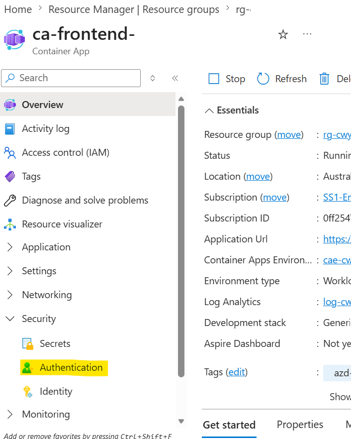
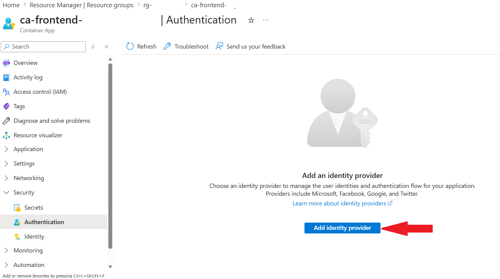
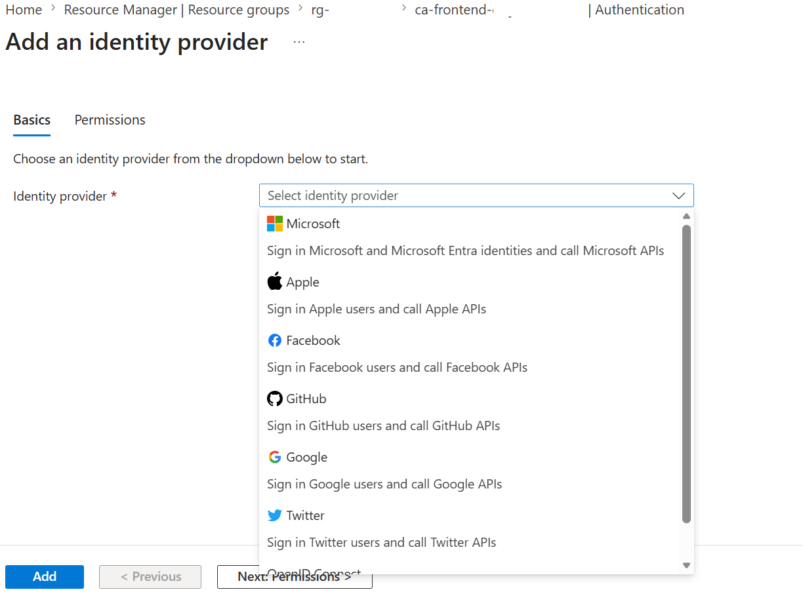
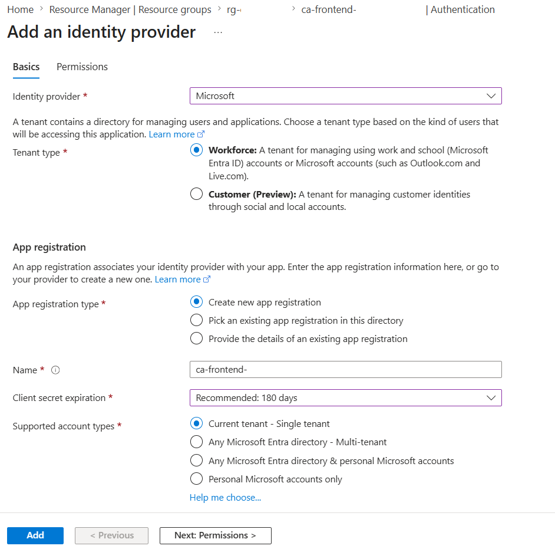
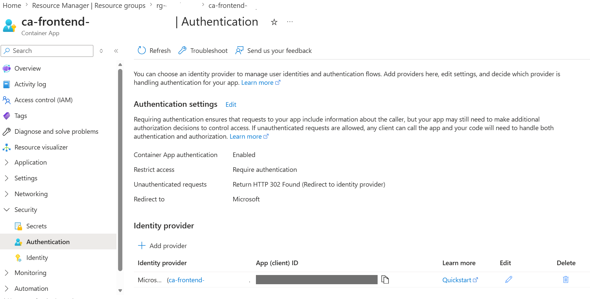

[Back to *Chat with your data* README](../README.md)

# Set Up Authentication in Azure Container Apps

This document provides step-by-step instructions to enable Microsoft Entra ID authentication on the frontend Container App (`ca-frontend-<suffix>`), the public web UI.

## Prerequisites

- Access to **Microsoft Entra ID**
- Necessary permissions to create and manage **App Registrations**

## Step 1: Add Authentication in the frontend Container App

1. Open the frontend Container App (`ca-frontend-<suffix>`) and click on `Authentication` from the left menu.

  

2. Click on `+ Add identity provider` to see a list of identity providers.

  

3. Click on `Identity Provider` dropdown to see a list of identity providers.

  

4. Select the first option `Microsoft Entra Id` from the drop-down list and select `client secret expiration` under App registration.
> NOTE: If `Create new app registration` is disabled, then go to [Create new app registration](create_new_app_registration.md) and come back to this step to complete the app authentication.

 

5. Accept the default values and click on `Add` button to go back to the previous page with the identity provider added.

 

6. You have successfully added app authentication, and now required to log in to access the application.