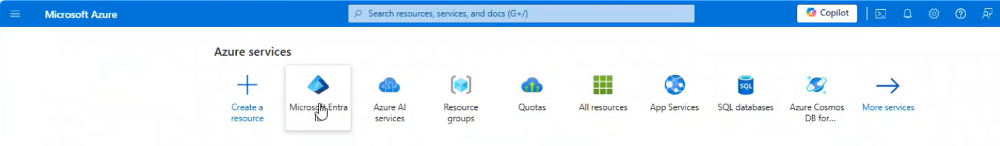
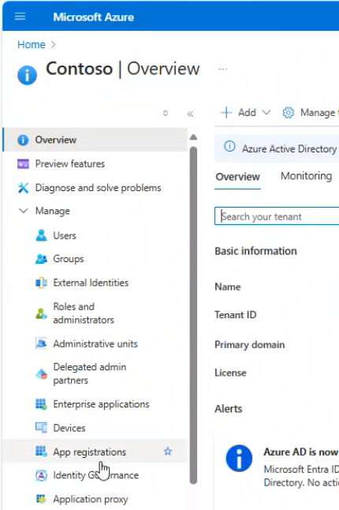
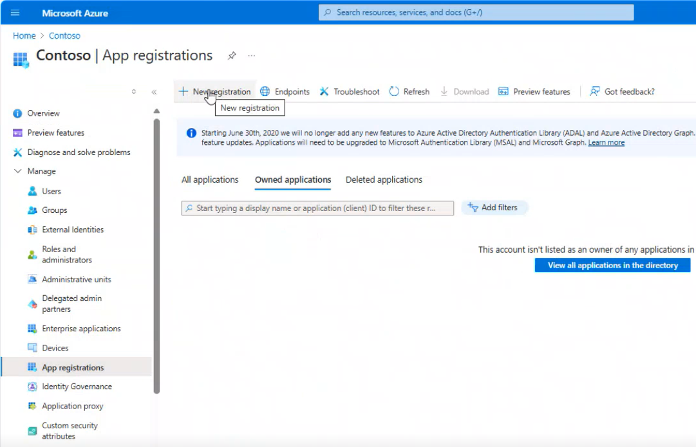
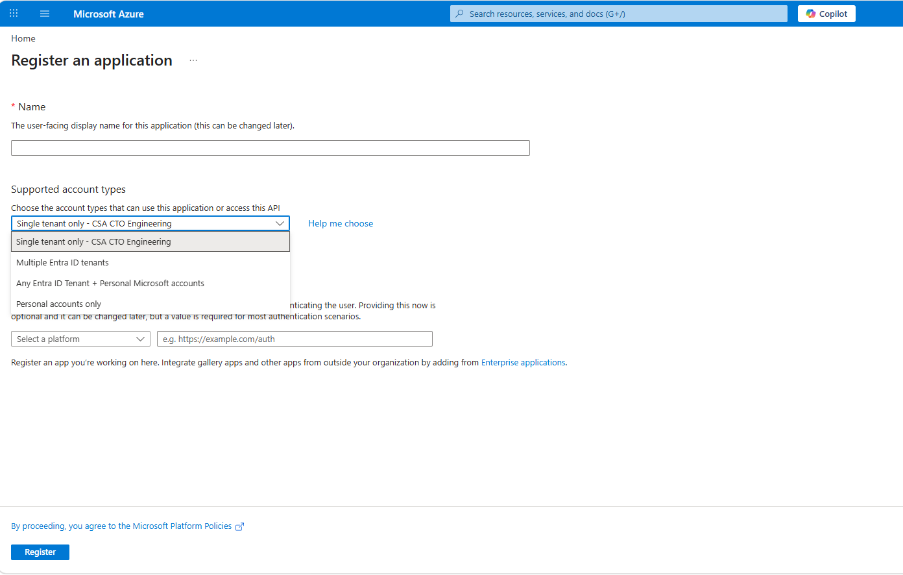
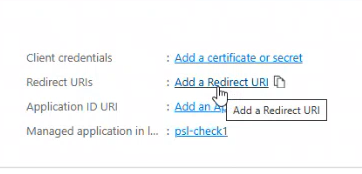
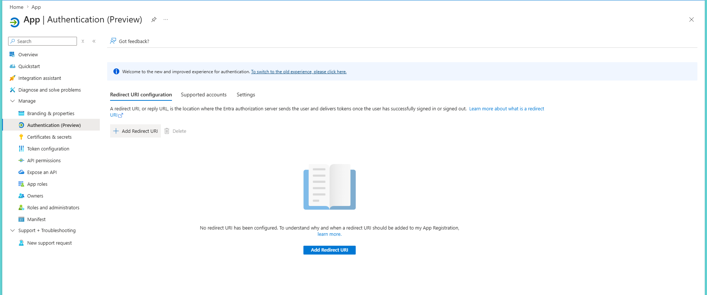
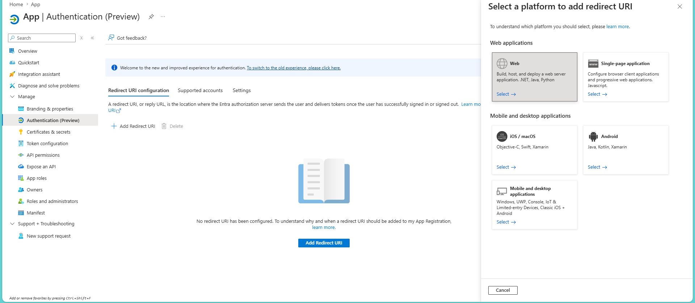
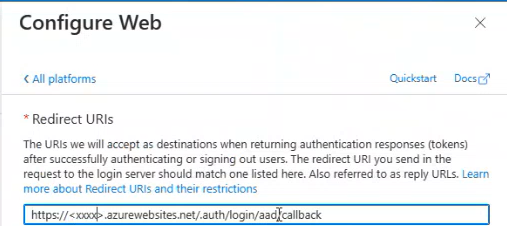

# Creating a new App Registration

1. Click on `Home` and select `Microsoft Entra ID`.

2. Click on `App registrations`.

3. Click on `+ New registration`.

4. Provide the `Name`, select supported account types as `Accounts in this organizational directory only(Contoso only - Single tenant)`, select platform as `Web`, enter/select the `URL` and register.

5. After application is created successfully, then click on `Add a Redirect URL`.

6. Click on `+ Add redirect URI`.

7. Click on `Web`.

8. Enter the frontend Container App's callback `URL` and Save. Then go back to [Set Up Authentication in Azure Container Apps](authentication_setup.md) Step 1 and follow from _Point 4_: choose `Pick an existing app registration in this directory` from the Add an identity provider page and provide the newly registered App Name.

E.g. `https://<CONTAINER_APP_FQDN>/.auth/login/aad/callback`

