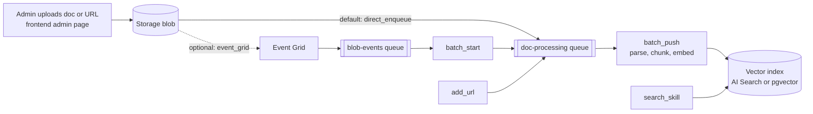

[Back to *Chat with your data* README](../README.md)

## Overview

Ingestion turns your documents into a searchable vector index. When an admin uploads a file or submits a URL, the content is stored, queued, and processed by the ingestion worker, which parses, chunks, embeds, and writes it to the index. The pipeline runs on queues, so large batches process reliably and retry on failure.

## Pipeline

## Stages

1. **Upload.** An admin uploads a document or submits a URL from the admin pages. Files land in a storage blob; URLs enter the pipeline directly.
2. **Detect.** How a new blob is picked up depends on the `ingestionTrigger` deploy-time setting. By default (`direct_enqueue`), the backend enqueues the document-processing message itself when it writes the blob, with no Event Grid in the path. In the optional `event_grid` mode, a storage Event Grid subscription raises a blob event onto the blob-events queue, which the ingestion worker translates into a processing message.
3. **Batch.** The pipeline expands a blob or batch into per-document work items on the processing queue.
4. **Process.** The ingestion worker parses each document, splits it into chunks, generates embeddings, and writes the chunks to the vector index.
5. **Index.** Processed chunks are written to Azure AI Search in `cosmosdb` mode, or to PostgreSQL with `pgvector` in `postgresql` mode.

## Reliability

The pipeline uses storage queues between stages. If a stage fails, the message is retried, and messages that fail repeatedly move to a poison queue for inspection instead of blocking the batch.

## Supported content

For the file formats you can ingest, see [Supported file types](supported_file_types.md). To add content, see [Admin and configuration](admin.md).

## Related documentation

* [Architecture overview](architecture.md)
* [Admin and configuration](admin.md)
* [Supported file types](supported_file_types.md)
