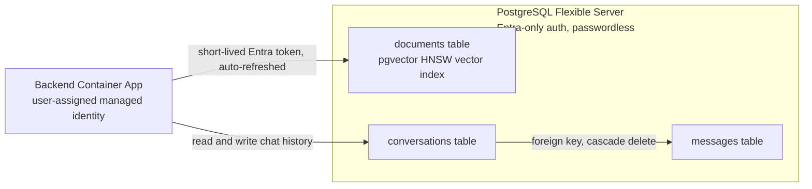

[Back to *Chat with your data* README](../README.md)


## Overview

Chat with Your Data can run on PostgreSQL. When you deploy with `databaseType=postgresql`, a single PostgreSQL Flexible Server holds both the retrieval index and the chat history, and no Azure AI Search resource is deployed. The other mode, `cosmosdb`, pairs Azure AI Search with Cosmos DB; see [Architecture overview](architecture.md) to compare them.

The following diagram shows the single server holding the vector index and the two chat-history tables, reached over a passwordless connection.



## Choosing PostgreSQL mode

Set the database type before you deploy:

```bash
azd env set AZURE_ENV_DATABASE_TYPE postgresql
azd up
```

The choice is locked after deployment. To switch, deploy a new environment.

## Passwordless authentication

The PostgreSQL server is configured for Microsoft Entra authentication only; password authentication is disabled. The application connects with the workload's user-assigned managed identity and a short-lived Entra token that is refreshed automatically, so there are no database passwords or connection-string secrets to store or rotate. The person who runs the deployment is set as the PostgreSQL Entra administrator by default; override this with the `AZURE_ENV_POSTGRES_ADMIN_PRINCIPAL_*` parameters. See [Managed identity and RBAC](managed_identity.md).

## Vector index

Retrieval uses the `pgvector` extension. The post-provision step enables the extension, and the application creates the `documents` table on first use. The table stores each chunk with its embedding:

```sql
SELECT content
FROM vector_store
ORDER BY content_vector <=> $1
LIMIT $2;
```


---

### 4. **Automated Table Creation**
The PostgreSQL deployment process automatically creates the necessary tables for chat history and vector storage, including table indexes. The script `create_postgres_tables.py` is executed as part of the infrastructure deployment, ensuring the database is ready for use immediately after setup.

---

### 8. **Secure PostgreSQL Connections**
All PostgreSQL connections use secure configurations:
- SSL is enabled with parameters such as `sslmode=verify-full`.
- Credentials are securely managed via environment variables and Key Vault integrations.

---

### 9. **Backend Enhancements**
- PostgreSQL database integration is included in the implementation of the Semantic Kernel orchestrator to ensure unified functionality.
- Database operations, including indexing and similarity searches, align with the CWYD workflow.

---

## Benefits of PostgreSQL Integration
1. **Scalability**: PostgreSQL offers robust data storage and table indexing capabilities suitable for large-scale deployments
2. **Flexibility**: Dynamic database switching allows users to choose between PostgreSQL and CosmosDB based on their requirements.
3. **Ease of Use**: Automated table creation and environment configuration simplify deployment and management.
4. **Security**: SSL-enabled connections and secure credential handling ensure data protection.


---

## Conclusion
PostgreSQL integration transforms CWYD into a versatile, scalable platform capable of handling advanced database storage, table indexing, and query scenarios. By leveraging PostgreSQL’s cutting edge features, CWYD ensures a seamless user experience, robust performance, and future-ready architecture.
