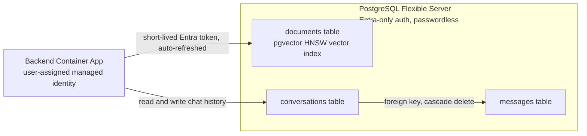

[Back to *Chat with your data* README](../README.md)


## Overview

Chat with Your Data can run on PostgreSQL. When you deploy with `databaseType=postgresql`, a single PostgreSQL Flexible Server holds both the retrieval index and the chat history, and no Azure AI Search resource is deployed. The other mode, `cosmosdb`, pairs Azure AI Search with Cosmos DB; see [Architecture overview](architecture.md) to compare them.

The following diagram shows the single server holding the vector index and the two chat-history tables, reached over a passwordless connection.



## Choosing PostgreSQL mode

Set the database type before you deploy:

```bash
azd env set DATABASE_TYPE postgresql
azd up
```

The choice is locked after deployment. To switch, deploy a new environment.

## Passwordless authentication

The PostgreSQL server is configured for Microsoft Entra authentication only; password authentication is disabled. The application connects with the workload's user-assigned managed identity and a short-lived Entra token that is refreshed automatically, so there are no database passwords or connection-string secrets to store or rotate. The person who runs the deployment is registered as the PostgreSQL Entra administrator automatically, derived from the deploying identity. See [Managed identity and RBAC](managed_identity.md).

## Vector index

Retrieval uses the `pgvector` extension. The post-provision step enables the extension, and the application creates the `documents` table on first use. The table stores each chunk with its embedding:

```sql
SELECT content
FROM documents
ORDER BY content_vector <=> $1
LIMIT $2;
```

## Related documentation

* [Architecture overview](architecture.md)
* [Managed identity and RBAC](managed_identity.md)
* [Chat history](chat_history.md)
* [Customize azd parameters](customizing_azd_parameters.md)
