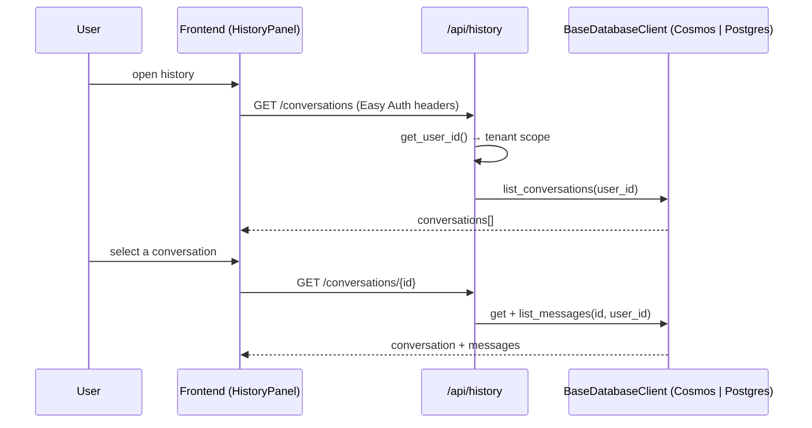
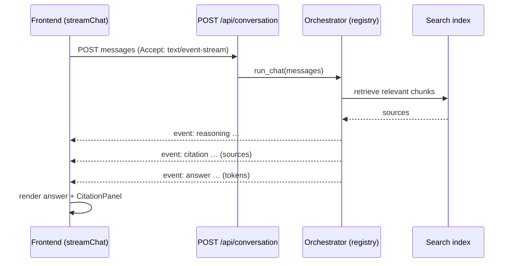
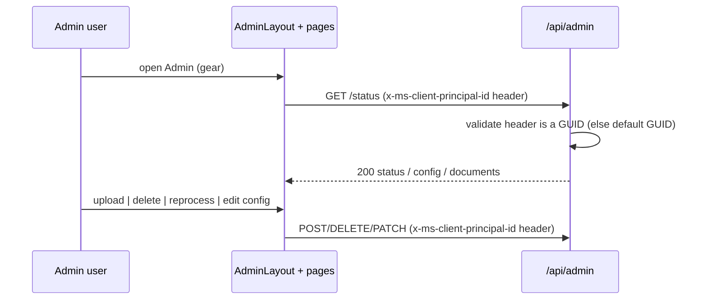
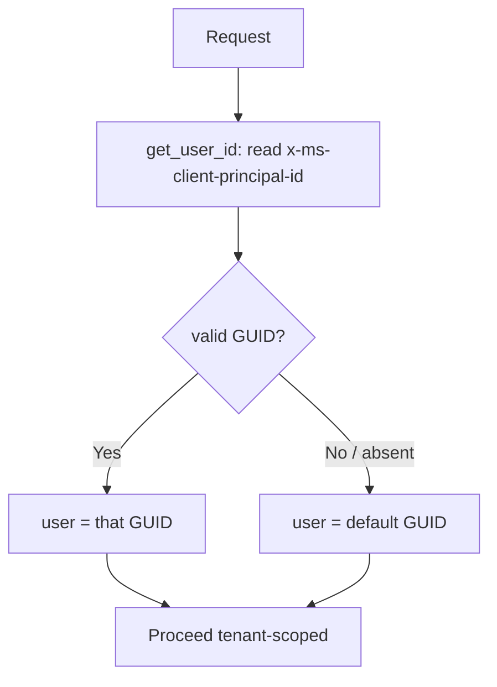

# CWYD v2 — MVP Status and Flow Guide

This document explains the four flows the team asked about — **chat history**, **citations**, **admin**, and **user login / auth** — and tracks the **tasks and subtasks left to finish the MVP**.

It is a flow-oriented companion to the canonical sources; it does not duplicate them:

- [development_plan.md](development_plan.md) — §0 status table + §0.1 / §0.2 debt queues are the source of truth for *what* is built and *when*.
- [project_status.md](project_status.md) — the per-dimension QA-readiness snapshot (test counts, gates, libraries).

Status legend: ✅ done · ⏳ in progress · ⏭ next · ☐ not started.

> **No environment-specific values appear here** (Hard Rule #18). Real subscription / tenant / resource ids live only in `.azure/<AZD_ENV_NAME>/.env` (gitignored) — read them with `azd env get-values`. Placeholders such as `<RESOURCE_GROUP>` and `<AZD_ENV_NAME>` stand in for operator values.

---

## Executive snapshot

- **Backend MVP surface is complete and green.** Chat, RAG, citations, chat history (Cosmos + Postgres), and the full admin REST surface are implemented, registry-wired, and resolve the caller's user id from the `x-ms-client-principal-id` header. See [project_status.md](project_status.md) for the live test/gate metrics.
- **Frontend MVP surface is mostly complete.** Chat, streaming reasoning/answer, citation panel, history panel, theme switch, and the four admin pages are shipped. Admin pages now live at real URLs (`/admin/ingest|delete|config|prompt`) inside a dedicated admin layout shell.
- **The header was simplified.** The blue "Chat" nav button was removed; a new chat starts from the broom / new-chat button. A gated **Admin** entry (gear) sits next to the history and theme controls and only appears when the caller has the admin role. Admin has its own layout with a **Home** button back to the chat.
- **The main remaining gaps are platform auth and frontend polish:** enabling Easy Auth on the hosting platform so identity headers are injected in production, a signed-in-user display, history rehydrate-on-select, and SSE abort/reconnect.

---

## 1. Chat history flow

Per-user conversation persistence over a registry-selected database (`cosmosdb` or `postgresql`, chosen at startup).

### How it works

- **Router:** [history.py](../src/backend/routers/history.py) mounts under `/api/history` and is a thin REST surface over the registered `BaseDatabaseClient`. The concrete client is selected in the app lifespan and dispatched through the `databases` registry (Hard Rule #4) — the router never branches on backend type.
- **Tenant isolation:** every route derives `user_id` from the `x-ms-client-principal-id` header via `get_user_id` ([dependencies.py](../src/backend/dependencies.py)), so each caller only ever sees their own conversations. When the header is absent or not a GUID, `get_user_id` falls back to the anonymous default GUID partition; it never raises.
- **Frontend:** [HistoryPanel.tsx](../src/frontend/src/pages/chat/components/HistoryPanel.tsx) lists conversations newest-first and toggles from the header clock button.

### Routes

| Method | Path | Purpose |
|---|---|---|
| GET | `/api/history/status` | backend + `db_type` discovery |
| GET | `/api/history/conversations` | list conversations (newest-first) |
| POST | `/api/history/conversations` | create a conversation |
| GET | `/api/history/conversations/{id}` | conversation + messages |
| PATCH | `/api/history/conversations/{id}` | rename |
| DELETE | `/api/history/conversations/{id}` | delete (idempotent → 204) |
| POST | `/api/history/conversations/{id}/messages` | append a message |
| POST | `/api/history/messages/{id}/feedback` | set thumbs feedback |

### Status and gaps

- ✅ Backend: all 8 routes, tenant-scoped, both database backends.
- ✅ Frontend: list + create + rename + delete + new-chat.
- ⏳ **Rehydrate-on-select:** clicking a past conversation should load its messages back into the chat transcript. Tracked under `#24` / `#25` in [development_plan.md](development_plan.md) §0.2.

---

## 2. Citations flow

Citations are produced by the RAG orchestrator and surfaced on a dedicated streaming channel, then rendered in a side panel.

### How it works

- **Endpoint:** [conversation.py](../src/backend/routers/conversation.py) exposes `POST /api/conversation`, content-negotiated by the `Accept` header:
  - `text/event-stream` → Server-Sent Events on the locked channel set **`reasoning` · `tool` · `answer` · `citation` · `error`** (Hard Rule #6). Each event is wire-framed as `event: <channel>\ndata: <json>\n\n`.
  - anything else → buffered JSON with the concatenated answer plus **deduplicated** citations.
- **Orchestration:** the orchestrator is resolved through the `orchestrators` registry and wrapped by the `run_chat` pipeline, which is the seam for content-safety / post-prompt guards. Reasoning tokens flow on the `reasoning` channel — never buried in the answer string.
- **Frontend:** [streamChat.tsx](../src/frontend/src/api/streamChat.tsx) consumes the SSE stream and routes each channel; [CitationPanel.tsx](../src/frontend/src/pages/chat/components/CitationPanel/CitationPanel.tsx) renders the sources behind the answer.

### Status and gaps

- ✅ Backend: typed `citation` SSE channel + deduplicated citations in the buffered path.
- ✅ Frontend: streaming answer + reasoning panel + citation panel on the live demo path.
- ⏳ **SSE polish:** cancel/abort an in-flight stream and reconnect/retry on a dropped connection. Tracked under `#24` in [development_plan.md](development_plan.md) §0.2.

---

## 3. Admin flow

A read/write operator surface for configuration and document management, reachable through the same header-based user id as the rest of the API.

### How it works

- **Router:** [admin.py](../src/backend/routers/admin.py) mounts under `/api/admin`. **Every route depends on `UserIdDep`**, which reads the `x-ms-client-principal-id` header, validates it is a GUID, and otherwise falls back to the anonymous default GUID. There is no application-layer role gate — identity enforcement, when enabled, is an ingress/proxy concern (see [ADR 0031](adr/0031-backend-admin-auth-header-only-ingress-enforced.md)).
- **Sanitized status:** `GET /api/admin/status` returns only non-secret values — tenant ids, UAMI ids, and full database / Cosmos endpoints are deliberately excluded.
- **Frontend:** the four admin pages live under a dedicated shell, [AdminLayout.tsx](../src/frontend/src/pages/admin/AdminLayout.tsx), which renders a sub-nav plus a **Home** button back to the chat. The pages are [IngestData.tsx](../src/frontend/src/pages/admin/IngestData/IngestData.tsx), [DeleteData.tsx](../src/frontend/src/pages/admin/DeleteData/DeleteData.tsx), [Configuration.tsx](../src/frontend/src/pages/admin/Configuration/Configuration.tsx), and [PromptEditor.tsx](../src/frontend/src/pages/admin/PromptEditor/PromptEditor.tsx). A gated **Admin** button in the header ([Header.tsx](../src/frontend/src/components/Header/Header.tsx)) navigates to `/admin/ingest` and only renders when the caller has the admin role.

### Routes

| Method | Path | Purpose |
|---|---|---|
| GET | `/api/admin/status` | sanitized runtime status snapshot |
| GET | `/api/admin/config` | runtime-toggle subset of settings |
| GET | `/api/admin/config/effective` | env defaults + persisted overrides + per-field provenance |
| PATCH | `/api/admin/config` | write runtime toggles (RFC 7396 merge, audited) |
| GET | `/api/admin/documents` | list indexed sources + chunk counts |
| DELETE | `/api/admin/documents/{source}` | delete every chunk for a source |
| POST | `/api/admin/documents/url` | fetch + parse + embed + index one URL |
| POST | `/api/admin/documents` | multipart upload → enqueue for indexing |
| POST | `/api/admin/documents/reprocess` | re-fan every blob onto the push queue |

### Status and gaps

- ✅ Backend: all 9 routes, header user-id resolved, config audit log written on every successful PATCH.
- ✅ Frontend: four pages, real URLs, dedicated layout, Home-to-chat, gated header entry. The Streamlit→React admin merge (`#35d`) is cleared.
- ⏳ **Delete Data UX (`#54`):** backend delete surface is shipped and the FE has multi-select delete + retry; final operator-workflow parity and table-state polish remain.
- ☐ **Audit-log viewer:** the backend persists admin config-change audit rows, but there is no FE page to view them yet.
- **Per-tenant config overrides (`#35g`): withdrawn — out of scope.** The single-tenant deployment makes tenant-keyed config a no-op over the singleton; the speculative tenant-claim seam was removed (see [ADR 0024](adr/0024-withdraw-per-tenant-runtime-config-single-tenant.md)).

---

## 4. User login / auth flow

The backend trusts the `x-ms-client-principal-id` request header for the caller's identity; it does not implement its own login. When platform authentication (App Service / Container Apps **Easy Auth**) is enabled, the platform injects and overwrites that header at the ingress, so a signed-in caller's real Entra object id reaches the backend; when it is not enabled, the frontend forwards the anonymous default GUID.

### How it works

- **One header:** `x-ms-client-principal-id` — the caller's user id (an Entra object id when Easy Auth is on, or the anonymous default GUID `00000000-0000-0000-0000-000000000000` when it is off).
- **Identity:** `get_user_id` ([dependencies.py](../src/backend/dependencies.py)) reads the header, validates it is a GUID, returns it as the tenant / partition key, and otherwise falls back to the default GUID. It never raises — there is no application-layer authentication gate.
- **No RBAC in application code:** the former `requires_role("admin")` role gate and the base64 `x-ms-client-principal` claims blob are gone (see [ADR 0031](adr/0031-backend-admin-auth-header-only-ingress-enforced.md)). Admin routes use the same `get_user_id` dependency as every other route.
- **Enforcement is at the ingress:** because `x-ms-client-principal-id` is a client-set, forgeable header, real authentication (when required) is enforced at the platform / proxy layer (Easy Auth), not in the backend — matching the MACAE posture.

### Status and gaps

- ✅ Backend: header user-id resolution is implemented and never fail-closes; verified by unit tests.
- ☐ **Easy Auth is not provisioned in infrastructure.** `v2/infra/main.bicep` wires Postgres AAD auth and function deployment-storage identity, but it does **not** configure App Service / Container Apps built-in authentication. Without it, real signed-in identity is never injected and every caller uses the default GUID. Enable it (in `v2/infra/**` or as a documented operator step) to complete real per-user identity.
- ☐ **Ingress protection for admin routes.** With the application-layer role gate removed, `/api/admin/*` (including writes) is reachable by anyone who can reach the backend FQDN. Before exposing the backend publicly, protect it at the ingress (private ingress, or Easy Auth on the backend Container App). See [ADR 0031](adr/0031-backend-admin-auth-header-only-ingress-enforced.md).
- ☐ **Frontend identity display:** there is no signed-in-user indicator or sign-out control in the UI yet.

---

## MVP completion plan

Tasks and subtasks left to call the MVP done. None of these block the backend, which is already green; they finish the production auth wiring and the frontend polish.

### A. Production auth wiring (highest priority)

| # | Task | Subtasks | Status |
|---|---|---|---|
| A1 | Enable Easy Auth on the hosting platform | Configure built-in authentication on the Container App / App Service ingress; map the Entra identity provider; confirm `x-ms-client-principal-*` headers reach the backend | ☐ |
| A2 | Protect `/api/admin/*` at the ingress | The app no longer gates admin routes (see [ADR 0031](adr/0031-backend-admin-auth-header-only-ingress-enforced.md)); restrict the backend admin surface at the ingress (private ingress, or Easy Auth on the backend Container App) so admin writes are not open on the public FQDN | ☐ |
| A3 | Frontend identity surface | Show the signed-in user; add a sign-out link to the Easy Auth endpoint; hide the admin entry unless the role is present (already gated by `adminAvailable`) | ☐ |

### B. Chat history frontend polish

| # | Task | Subtasks | Status |
|---|---|---|---|
| B1 | Rehydrate a conversation on select (`#24` / `#25`) | Call `GET /api/history/conversations/{id}` on click; replace the chat transcript; render stored feedback; handle loading / empty / error states | ⏳ |

### C. Citations / streaming frontend polish

| # | Task | Subtasks | Status |
|---|---|---|---|
| C1 | SSE abort + reconnect (`#24`) | Cancel the in-flight stream on new send / navigation; retry or resume on a dropped connection; surface `error`-channel events to the user | ⏳ |

### D. Admin frontend completion

| # | Task | Subtasks | Status |
|---|---|---|---|
| D1 | Delete Data UX parity (`#54`) | Finalize operator workflow details; table-state UX polish for multi-select + retry | ⏳ |
| D2 | Admin audit-log viewer | Add a read-only page over the persisted config-change audit rows (needs a list endpoint or reuse of existing storage) | ☐ |
| D3 | Per-tenant config overrides (`#35g`) | **Withdrawn — out of scope.** Single-tenant deployment ⇒ tenant-keyed config is a no-op over the singleton; tenant-claim seam removed (see [ADR 0024](adr/0024-withdraw-per-tenant-runtime-config-single-tenant.md)) | — withdrawn |

### E. Deploy and verify

| # | Task | Subtasks | Status |
|---|---|---|---|
| E1 | End-to-end green deploy | `azd up` (or `docker compose up`) succeeds; smoke chat + citations + history + admin against the deployed env `<AZD_ENV_NAME>` | ⏳ |

---

## What is missing (consolidated)

| Area | Missing item | Blocks MVP? | Reference |
|---|---|---|---|
| Auth | Easy Auth not configured in infra (no header injection in prod) | Yes (production) | this doc §4, `v2/infra/**` |
| Auth | `admin` app role definition + assignment | Yes (admin in prod) | this doc §4 |
| Auth | Signed-in-user display + sign-out in the UI | No (polish) | this doc §A3 |
| Chat history | Rehydrate-on-select in the chat view | No (polish) | `#24` / `#25` |
| Citations | SSE abort + reconnect | No (polish) | `#24` |
| Admin | Delete Data final UX parity | No (polish) | `#54` |
| Admin | Audit-log viewer page | No (nice-to-have) | this doc §D2 |
| Admin | Per-tenant config overrides | No (withdrawn — out of scope) | `#35g` / [ADR 0024](adr/0024-withdraw-per-tenant-runtime-config-single-tenant.md) |

---

## References

- [development_plan.md](development_plan.md) — §0 status snapshot, §0.1 backend debt queue, §0.2 frontend debt queue.
- [project_status.md](project_status.md) — per-dimension QA readiness, live test/gate metrics.
- Backend routers: [conversation.py](../src/backend/routers/conversation.py), [history.py](../src/backend/routers/history.py), [admin.py](../src/backend/routers/admin.py), [dependencies.py](../src/backend/dependencies.py).
- Frontend: [Header.tsx](../src/frontend/src/components/Header/Header.tsx), [AdminLayout.tsx](../src/frontend/src/pages/admin/AdminLayout.tsx), [streamChat.tsx](../src/frontend/src/api/streamChat.tsx), [CitationPanel.tsx](../src/frontend/src/pages/chat/components/CitationPanel/CitationPanel.tsx), [HistoryPanel.tsx](../src/frontend/src/pages/chat/components/HistoryPanel.tsx).
